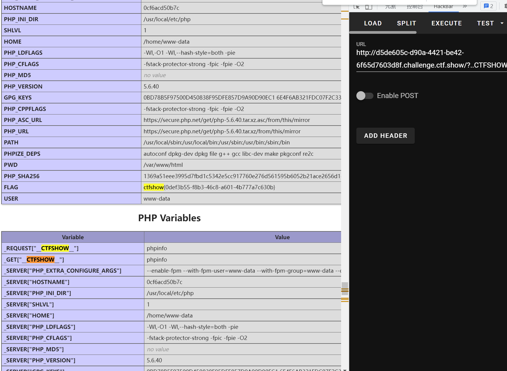

# 知识点
### __autoload
[https://www.php.cn/php-weizijiaocheng-426838.html](https://www.php.cn/php-weizijiaocheng-426838.html)<br />这个题一点点小坑__autoload()函数不是类里面的<br />__autoload — 尝试加载未定义的类<br />最后构造?..CTFSHOW..=phpinfo就可以看到phpinfo信息啦<br />原因是..CTFSHOW..解析变量成__CTFSHOW__然后进行了变量覆盖，因为CTFSHOW是类就会使用<br />__autoload()函数方法，去加载，因为等于phpinfo就会去加载phpinfo<br />接下来就去getshell啦
# 思路
```python
<?php

/*
# -*- coding: utf-8 -*-
# @Author: h1xa
# @Date:   2020-10-13 11:25:09
# @Last Modified by:   h1xa
# @Last Modified time: 2020-10-19 07:12:57

*/
include("flag.php");
error_reporting(0);
highlight_file(__FILE__);

class CTFSHOW{
    private $username;
    private $password;
    private $vip;
    private $secret;

    function __construct(){
        $this->vip = 0;
        $this->secret = $flag;
    }

    function __destruct(){
        echo $this->secret;
    }

    public function isVIP(){
        return $this->vip?TRUE:FALSE;
        }
    }

    function __autoload($class){
        if(isset($class)){
            $class();
    }
}

#过滤字符
$key = $_SERVER['QUERY_STRING'];
if(preg_match('/\_| |\[|\]|\?/', $key)){
    die("error");
}
$ctf = $_POST['ctf'];
extract($_GET);
if(class_exists($__CTFSHOW__)){
    echo "class is exists!";
}

if($isVIP && strrpos($ctf, ":")===FALSE && strrpos($ctf,"log")===FALSE){
    include($ctf);
}
```
```python
?..CTFSHOW..=phpinfo
```

