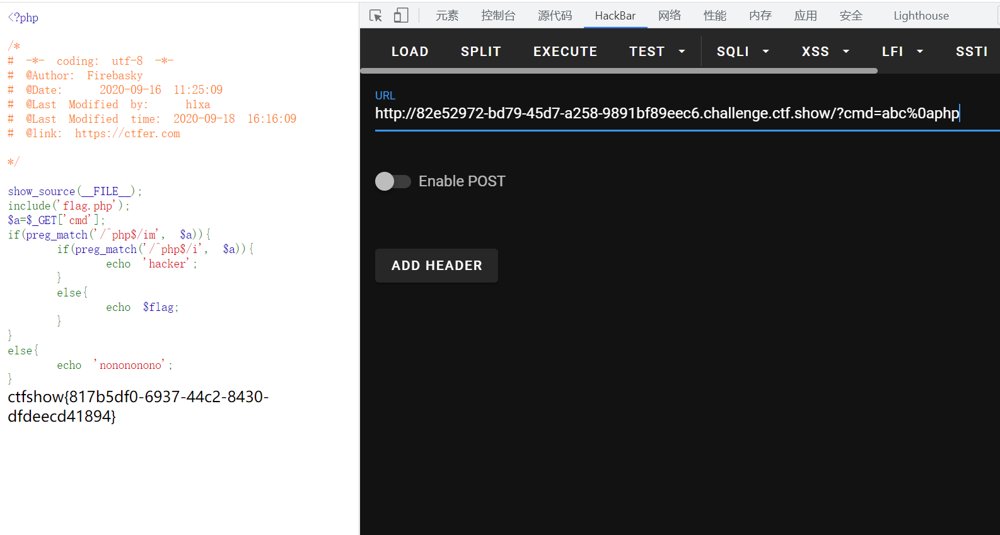

# 知识点
[https://blog.csdn.net/qq_46091464/article/details/108278486](https://blog.csdn.net/qq_46091464/article/details/108278486)
# 思路
```php
<?php

show_source(__FILE__);
include('flag.php');
$a=$_GET['cmd'];
if(preg_match('/^php$/im', $a)){
    if(preg_match('/^php$/i', $a)){
        echo 'hacker';
    }
    else{
        echo $flag;
    }
}
else{
    echo 'nonononono';
}
```
运用%0a换行来绕过<br />
