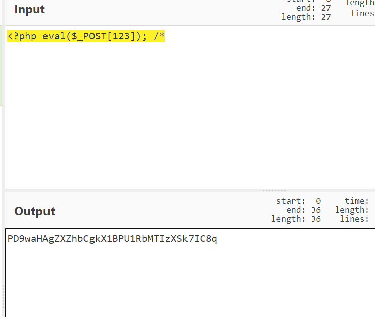
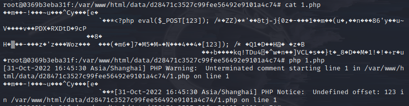

[https://f1sh.site/2018/11/25/code-breaking-puzzles%E5%81%9A%E9%A2%98%E8%AE%B0%E5%BD%95/](https://f1sh.site/2018/11/25/code-breaking-puzzles%E5%81%9A%E9%A2%98%E8%AE%B0%E5%BD%95/) 在做code-breaking 2018的phpmagic时，通过base64绕过htmlspecialchars 但总是因为php解析方面的问题导致文件无法正常解析 通过无数尝试总结几个注意点
# base64编码前面要为4的倍数
要使用php://filter/write=convert.base64-decode/resource=1.php来解码base64，要注意base64前面的字符数为4的倍数
# base64末位不要带=
因为此次base64编码是在中间位置，末位有=号会导致解析出错
# base64编码后解析有问题，可以在后面加上注释符
code-breaking 2018的phpmagic，我无法解析便是后面字符解析有错误 所以我在后面添加了/*的注释符，使得问题得到解决  
