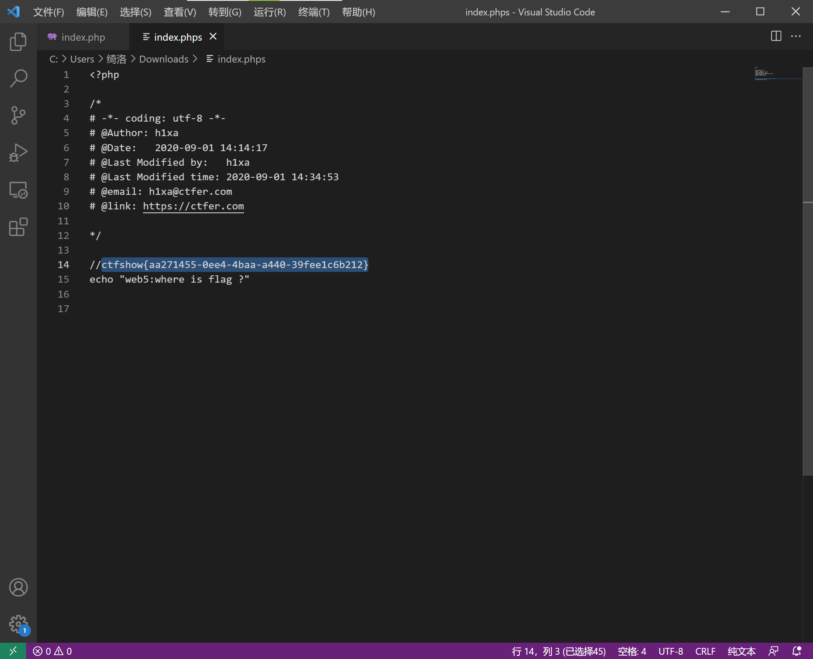

# 知识点
### phps
.phps文件就是php的源代码文件，通常用于提供给用户（访问者）查看php代码，因为用户无法直接通过Web浏览器看到php文件的内容，所以需要用phps文件代替。其实，只要不用php等已经在服务器中注册过的MIME类型为文件即可，但为了国际通用，所以才用了phps文件类型。 它的MIME类型为：text/html, application/x-httpd-php-source, application/x-httpd-php3-source
# 思路
访问index.phps  源码泄露 
