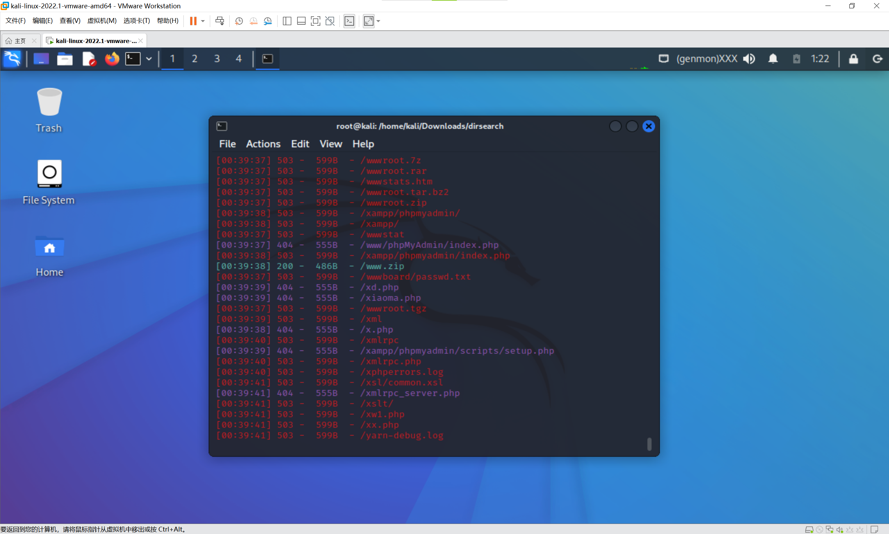
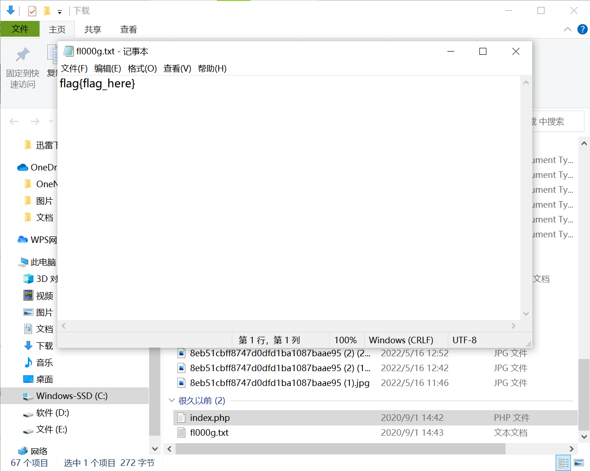

# 知识点
### 备份压缩文件
在网站的使用过程中，往往需要对网站中的文件进行修改、升级。此时就需要对网站整站或者其中某一页面进行备份。当备份文件或者修改过程中的缓存文件因为各种原因而被留在网站web目录下，而该目录又没有设置访问权限时，便有可能导致备份文件或者编辑器的缓存文件被下载，导致敏感信息泄露，给服务器的安全埋下隐患。<br />**漏洞成因及危害:**<br />该漏洞的成因主要有以下两种：

1. 服务器管理员错误地将网站或者网页的备份文件放置到服务器web目录下。
2. 编辑器在使用过程中自动保存的备份文件或者临时文件因为各种原因没有被删除而保存在web目录下。
```
.rar.zip.7z.tar.gz.bak.swp.txt.html
```
### dirsearch
下载地址<br />[https://github.com/maurosoria/dirsearch](https://github.com/maurosoria/dirsearch)
#### Simple usage
```bash
python3 dirsearch.py -u https://target
python3 dirsearch.py -e php,html,js -u https://target
python3 dirsearch.py -e php,html,js -u https://target -w /path/to/wordlist
```
# 思路
用dirsearch扫目录扫到www.zip<br /><br />解压文件获得flag<br />
