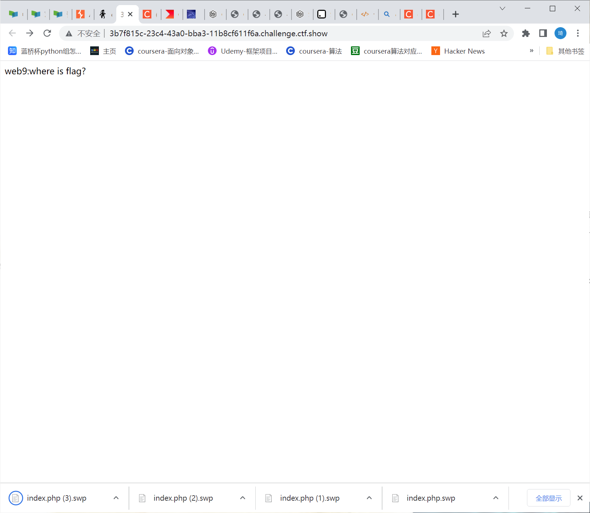
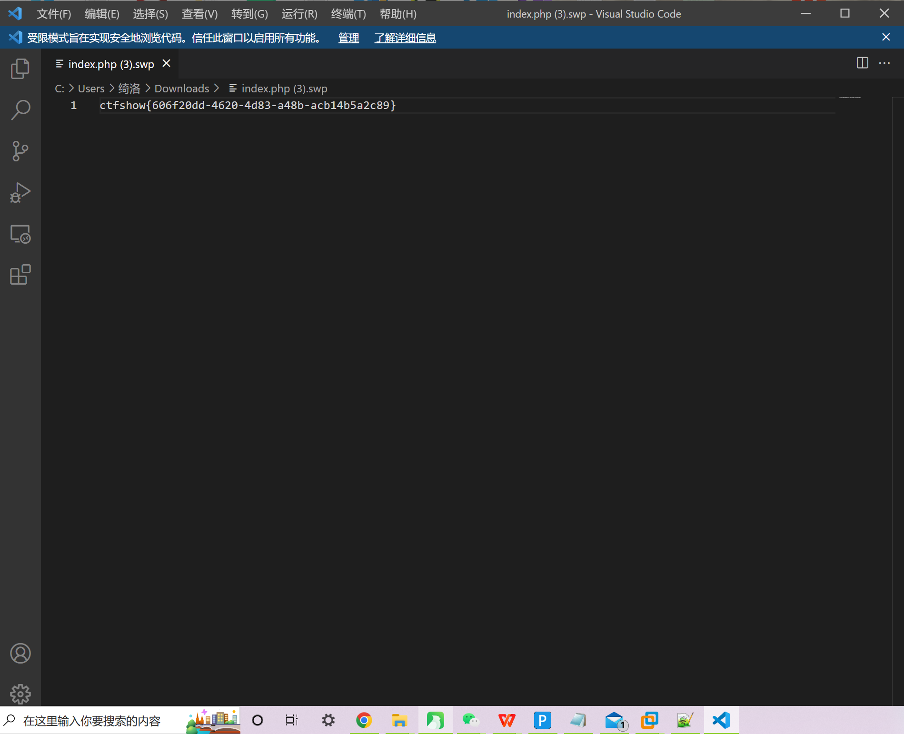

# 知识点
临时文件是在vim编辑文本时就会创建的文件，如果程序正常退出，临时文件自动删除，如果意外退出就会保留，当vim异常退出后，因为未处理缓存文件，导致可以通过缓存文件恢复原始文件内容

以 index.php 为例 第一次产生的缓存文件名为 .index.php.swp 第二次意外退出后，文件名为.index.php.swo 第三次产生的缓存文件则为 .index.php.swn 注意：index前有 " . "
# 思路
### 类似题目
[https://www.ctfhub.com/#/skilltree](https://www.ctfhub.com/#/skilltree) 访问index.php.swap下载源码  查看 
