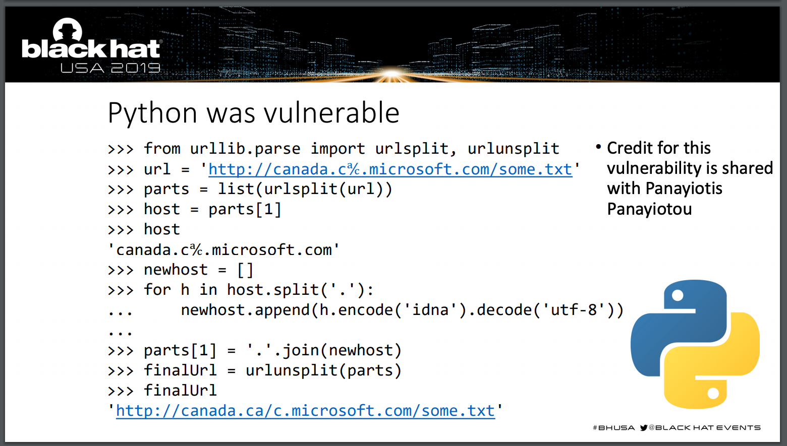

# WP
[[SUCTF 2019]Pythonginx（Idna与utf-8编码漏洞）_cve-2019-9636_paidx0的博客-CSDN博客](https://blog.csdn.net/weixin_49656607/article/details/119974145?spm=1001.2101.3001.6650.3&utm_medium=distribute.pc_relevant.none-task-blog-2%7Edefault%7ECTRLIST%7ERate-3-119974145-blog-113730543.235%5Ev38%5Epc_relevant_anti_vip&depth_1-utm_source=distribute.pc_relevant.none-task-blog-2%7Edefault%7ECTRLIST%7ERate-3-119974145-blog-113730543.235%5Ev38%5Epc_relevant_anti_vip&utm_relevant_index=4) [SUCTF 2019 Writeup — De1ta - 先知社区](https://xz.aliyun.com/t/6042#toc-20) [https://su-team.cn/passages/2019-08-22-SUCTF/](https://su-team.cn/passages/2019-08-22-SUCTF/)
# 知识点
blackhat 2019  python `urllib.urlsplit` unicode域名解析的问题  [us-19-Birch-HostSplit-Exploitable-Antipatterns-In-Unicode-Normalization.pdf](https://www.yuque.com/attachments/yuque/0/2023/pdf/25358086/1688461705094-cbb86e0d-16c2-472f-a34d-c698f4e01da0.pdf) [idna与utf-8编码漏洞 - Hanamizuki花水木 - 博客园](https://www.cnblogs.com/cimuhuashuimu/p/11490431.html)

