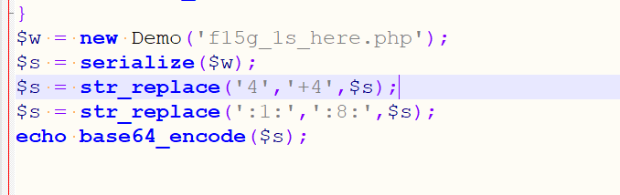

### 正则一
```php
if (preg_match('/[oc]:\d+:/i', $var)) {
  die('stop hacking!');
```
说下这个正则 `/[oc]:\d+:/i  [oc]`  两个字母构成的原子表加：再加只是一个数字，再加： 然后不区分大小写<br />这个O 是序列化里面的类 C是自定义序列化方式<br />如果这个正则的绕过是`O:+4` 这样就可以绕过<br />
