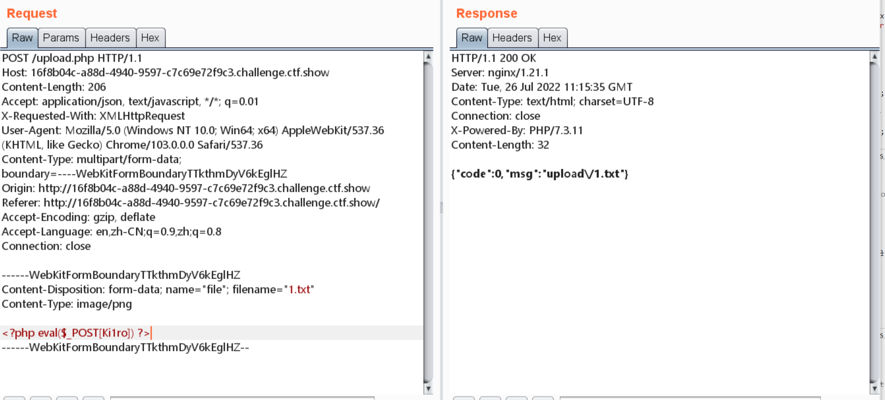

# 知识点
### .user.ini / .htaccess
[https://www.php.net/manual/en/configuration.file.per-user.php](https://www.php.net/manual/en/configuration.file.per-user.php)
### php.ini相关的选项
[https://www.php.net/manual/en/ini.list.php](https://www.php.net/manual/en/ini.list.php) [auto_append_file](https://www.php.net/manual/en/ini.core.php#ini.auto-append-file) 将指定文件包含在文件尾 [auto_prepend_file](https://www.php.net/manual/en/ini.core.php#ini.auto-prepend-file) 将指定文件包含在文件头

# 思路
### 方法一
写入配置文件  抓包上传配置文件  上传木马文件  访问/upload时，1.txt会包含在index.php的文件尾被解析，就可以进行命令执行了 
### 方法二 通过控制配置文件 包含log日志
我们还可以通过配置文件包含log日志  进行rce 
