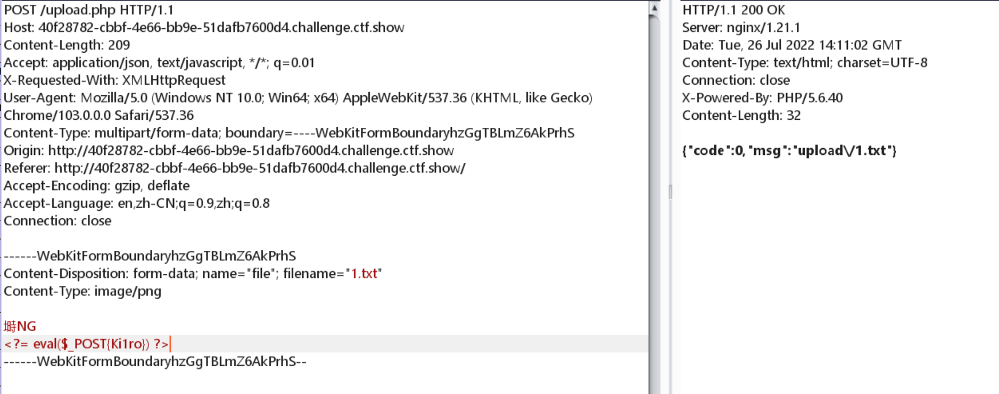
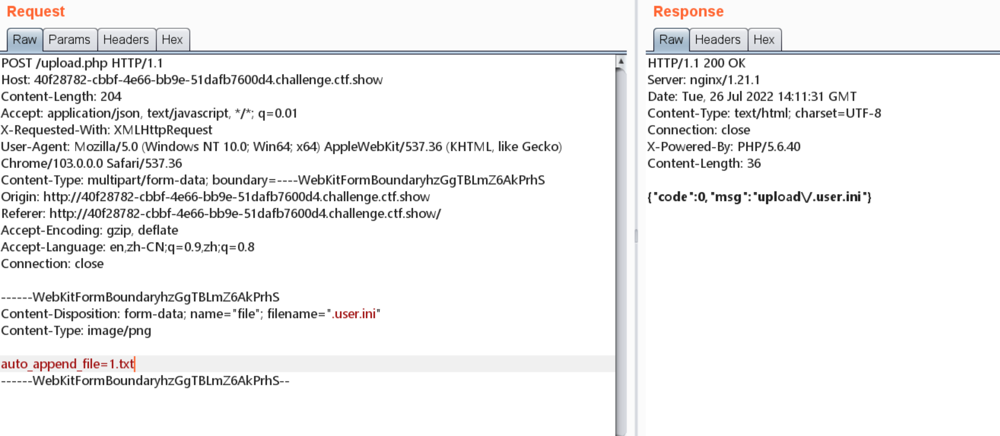
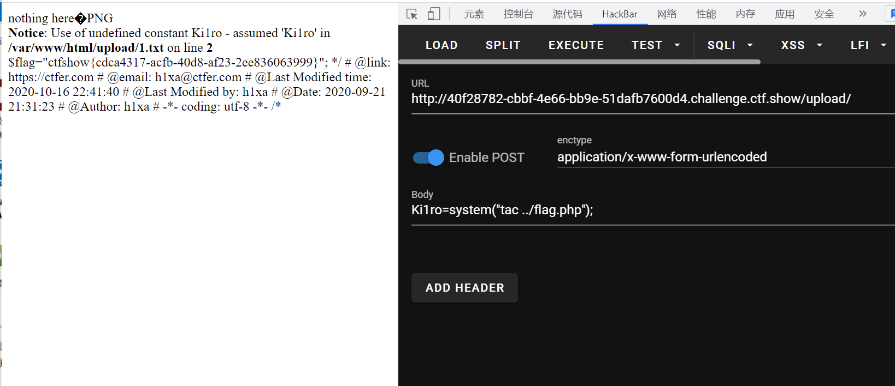

# 知识点
增加过滤了方括号
# 思路
```python
<?php

/*
# -*- coding: utf-8 -*-
# @Author: h1xa
# @Date:   2020-10-24 19:34:52
# @Last Modified by:   h1xa
# @Last Modified time: 2020-10-26 15:49:51
# @email: h1xa@ctfer.com
# @link: https://ctfer.com

*/
error_reporting(0);
if ($_FILES["file"]["error"] > 0)
{
	$ret = array("code"=>2,"msg"=>$_FILES["file"]["error"]);
}
else
{
    $filename = $_FILES["file"]["name"];
    $filesize = ($_FILES["file"]["size"] / 1024);
    if($filesize>1024){
    	$ret = array("code"=>1,"msg"=>"文件超过1024KB");
    }else{
    	if($_FILES['file']['type'] == 'image/png'){
            $arr = pathinfo($filename);
            $ext_suffix = $arr['extension'];
            if($ext_suffix!='php'){
                $content = file_get_contents($_FILES["file"]["tmp_name"]);
                if(stripos($content, "php")===FALSE && stripos($content,"[")===FALSE){
                    move_uploaded_file($_FILES["file"]["tmp_name"], "upload/".$_FILES["file"]["name"]);
                    $ret = array("code"=>0,"msg"=>"upload/".$_FILES["file"]["name"]);
                }else{
                    $ret = array("code"=>2,"msg"=>"文件类型不合规");
                }
                
            }else{
                $ret = array("code"=>2,"msg"=>"文件类型不合规");
            }
    		
    	}else{
    		$ret = array("code"=>2,"msg"=>"文件类型不合规");
    	}
    	
    }

}

echo json_encode($ret);

```
测试可知增加过滤了[  所以用{ }代替[ ]上传1.txt<br /><br />任然上传配置文件进行包含<br /><br />命令执行获取flag<br />
