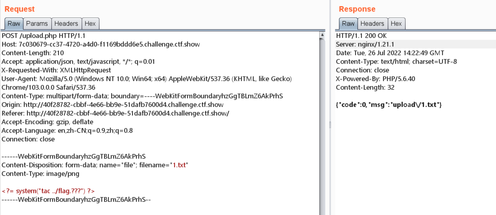
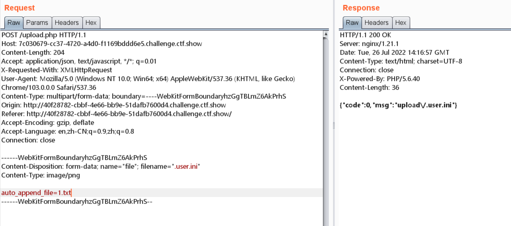
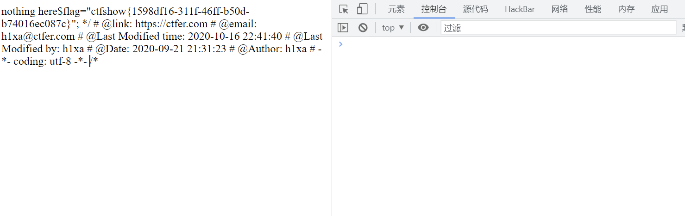
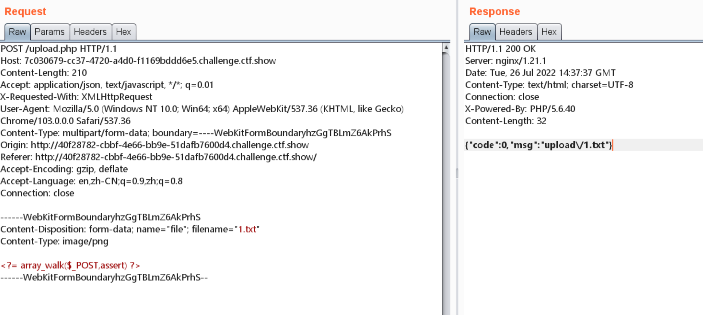
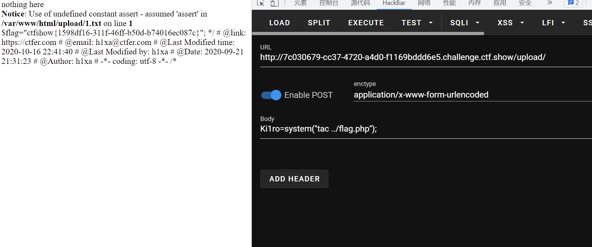

# 知识点
增加过滤花括号 分号
### array_walk
[https://www.php.net/manual/zh/function.array-walk](https://www.php.net/manual/zh/function.array-walk)
# 思路
### 方法一
增加过滤了花括号，索性直接cat flag  上传配置文件  访问获取flag 
### 方法二 可以使用一些数组函数进行代码执行
我这里使用array_walk()  依然配置文件 进行命令执行 
