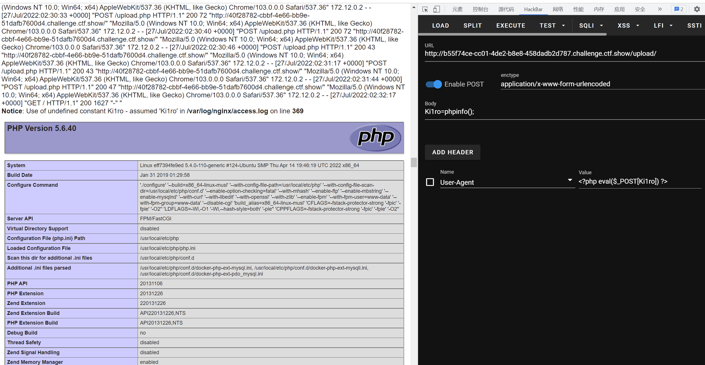

# 知识点
### getimagesize （对这个函数还是有些疑惑，为什么加GIF头就可以判断为正确,其他图片的文件头就不可以）
[https://www.php.net/manual/zh/function.getimagesize](https://www.php.net/manual/zh/function.getimagesize)
# 思路
一直测试，也想到用文件头检测，但一直用的是PNG文件，没想到是GIF文件，所以在每个文件上加上GIF89a\r\n\r\n就能通过测试，字符过滤fuzz后发现没有增加<br />继续log日志包含，配置文件控制<br /><br />查看源码发现是使用了getimagesize，判断是否为有效图片，可以通过添加GIF头绕过
```python
<?php

*/
error_reporting(0);
if ($_FILES["file"]["error"] > 0)
{
	$ret = array("code"=>2,"msg"=>$_FILES["file"]["error"]);
}
else
{
    $filename = $_FILES["file"]["name"];
    $filesize = ($_FILES["file"]["size"] / 1024);
    if($filesize>1024){
    	$ret = array("code"=>1,"msg"=>"文件超过1024KB");
    }else{
    	if($_FILES['file']['type'] == 'image/png'){
            $arr = pathinfo($filename);
            $ext_suffix = $arr['extension'];
            if($ext_suffix!='php'){
                $content = file_get_contents($_FILES["file"]["tmp_name"]);
                if(stripos($content, "php")===FALSE && check($content) && getimagesize($_FILES["file"]["tmp_name"])){
                    move_uploaded_file($_FILES["file"]["tmp_name"], "upload/".$_FILES["file"]["name"]);
                    $ret = array("code"=>0,"msg"=>"upload/".$_FILES["file"]["name"]);
                }else{
                    $ret = array("code"=>2,"msg"=>"文件类型不合规");
                }
                
            }else{
                $ret = array("code"=>2,"msg"=>"文件类型不合规");
            }
    		
    	}else{
    		$ret = array("code"=>2,"msg"=>"文件类型不合规");
    	}
    	
    }

}
function check($str){
    return !preg_match('/php|\{|\[|\;|log|\(| |\`/i', $str);
}
echo json_encode($ret);

```
