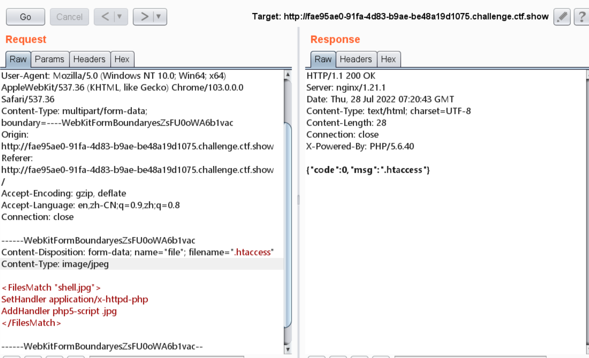
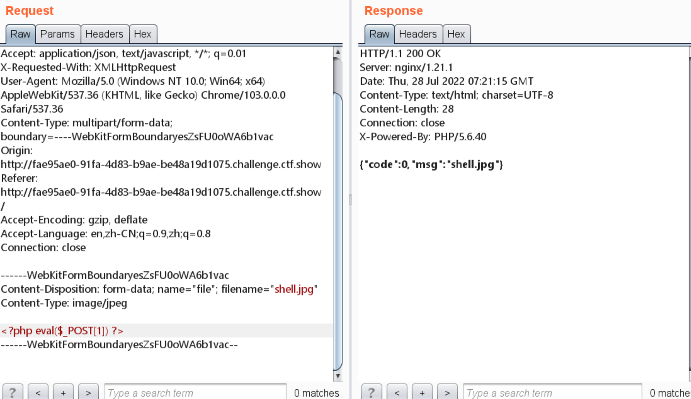
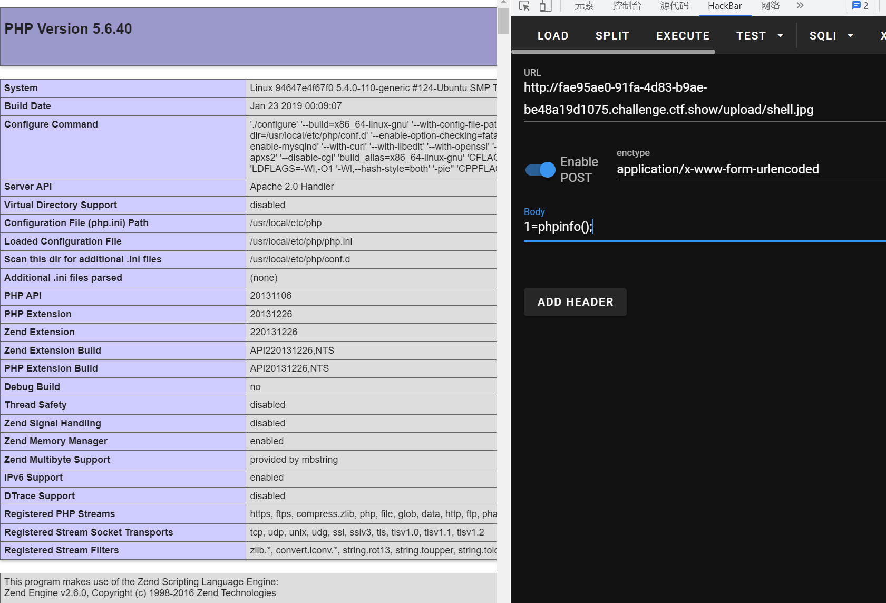
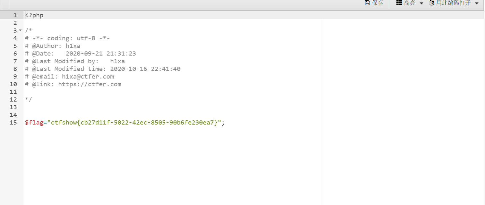

# 知识点
### .htaccess配置文件可控
apache官方文档<br />[https://httpd.apache.org/docs/current/howto/htaccess.html](https://httpd.apache.org/docs/current/howto/htaccess.html)
#### .htaccess文件利用技巧
[https://zhuanlan.zhihu.com/p/31763240](https://zhuanlan.zhihu.com/p/31763240)
# 思路
```python
<?php

#error_reporting(0);
if ($_FILES["file"]["error"] > 0)
{
	$ret = array("code"=>2,"msg"=>$_FILES["file"]["error"]);
}
else
{
    $filename = $_FILES["file"]["name"];
    $filesize = ($_FILES["file"]["size"] / 1024);
    if($filesize>1024){
    	$ret = array("code"=>1,"msg"=>"文件超过1024KB");
    }else{
    	if($_FILES['file']['type'] == 'image/jpeg'){
            $arr = pathinfo($filename);
            $ext_suffix = $arr['extension'];
            if(!in_array($ext_suffix, array("php"))){
                move_uploaded_file($_FILES["file"]["tmp_name"], './upload/'.$_FILES["file"]["name"]);
                $ret = array("code"=>0,"msg"=>$_FILES["file"]["name"]);
            }else{
                $ret = array("code"=>3,"msg"=>"只允许上传jpg格式文件");
            }
            
    		
    	}else{
    		$ret = array("code"=>2,"msg"=>"文件类型不合规");
    	}
    	
    }

}


echo json_encode($ret);

```
题目提示httpd，所以我们可以控制.htaccess配置文件<br />测试出后端对MIME进行了限制，将其改为image/jpeg，上传apache配置文件,使jpg文件能用应用于php解析<br /><br />再上传一句话木马<br /><br />能够rce<br /><br />蚁剑连接获取flag<br />
