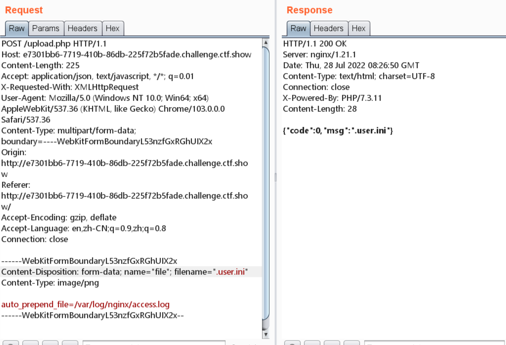
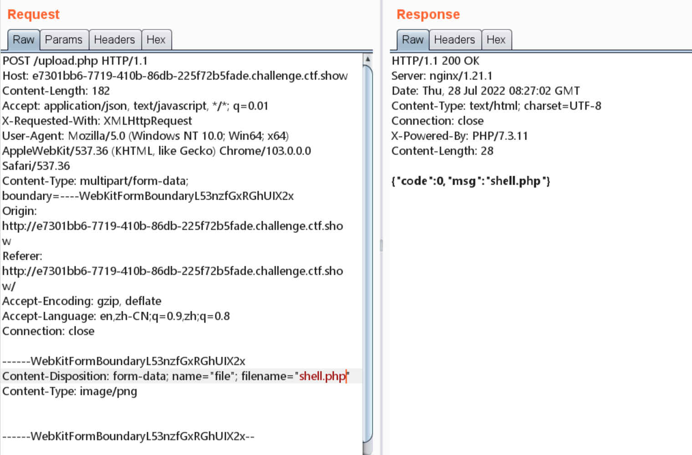
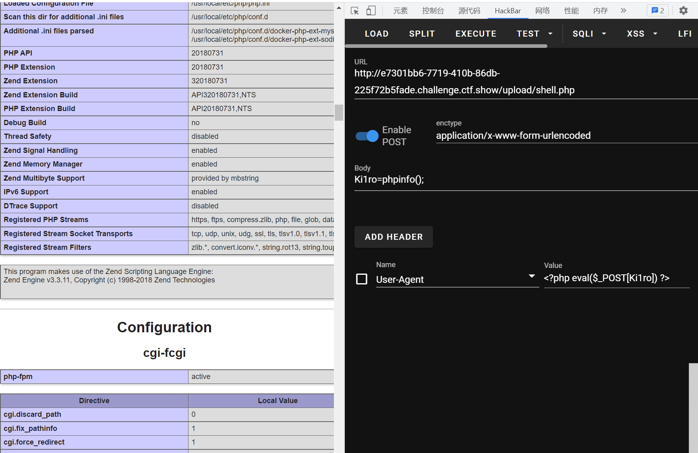
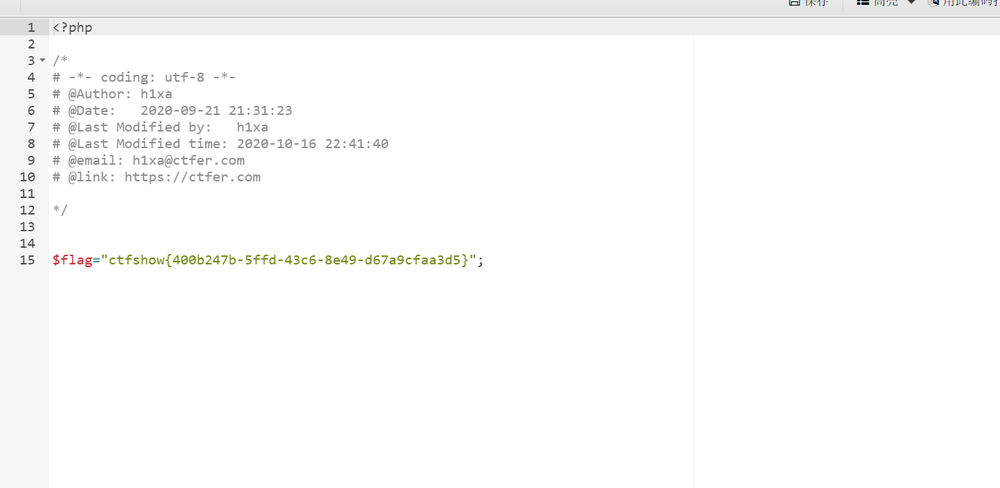

# 知识点
对一些字符以及字符串进行了过滤
### log日志包含
# 思路
```python
<?php

/*
# -*- coding: utf-8 -*-
# @Author: h1xa
# @Date:   2020-10-24 19:34:52
# @Last Modified by:   h1xa
# @Last Modified time: 2020-10-30 00:11:17
# @email: h1xa@ctfer.com
# @link: https://ctfer.com

*/
error_reporting(0);
if ($_FILES["file"]["error"] > 0)
{
	$ret = array("code"=>2,"msg"=>$_FILES["file"]["error"]);
}
else
{
    $filename = $_FILES["file"]["name"];
    $filesize = ($_FILES["file"]["size"] / 1024);
    if($filesize>1024){
    	$ret = array("code"=>1,"msg"=>"文件超过1024KB");
    }else{
    	if($_FILES['file']['type'] == 'image/png'){
            $str = file_get_contents($_FILES["file"]["tmp_name"]);
            if(check($str)===0){
                move_uploaded_file($_FILES["file"]["tmp_name"], './upload/'.$_FILES["file"]["name"]);
                $ret = array("code"=>0,"msg"=>$_FILES["file"]["name"]);
            }
            
    	}else{
    		$ret = array("code"=>2,"msg"=>"文件类型不合规");
    	}
    	
    }

}

function check($str){
    return preg_match('/eval|include|require|assert|assert|_POST|_GET|_COOKIE|system|shell_exec|php|\\$|\?|\<|\>/i', $str);
}

echo json_encode($ret);

```
任然可以用log日志包含过<br />上传配置文件<br /><br />上传php文件<br /><br />UA请求携带一句话木马<br /><br />连接蚁剑获取flag<br />
