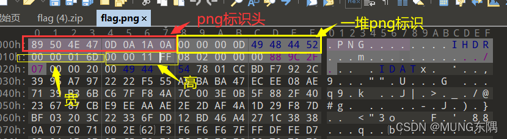

### 
### PNG
`finfo_file`对PNG图片的识别
```powershell
root@950378d61f89:/tmp# echo '<?php $f = finfo_open(FILEINFO_MIME_TYPE); var_dump(finfo_file($f, "test.bin"));' > test.php
root@950378d61f89:/tmp# echo -en "\x89PNG\r\n\x1a\n\0\0\0\rIHDR\0\0\1\x90\0\0\1\x90\8\6\0\0\0\x80\xbf6\xcc" > test.bin; php test.php
string(9) "image/png"
root@950378d61f89:/tmp# echo -en "\x89PNG\r\n\x1a\n\0\0\0\rIHDR" > test.bin; php test.php
string(9) "image/png"
root@950378d61f89:/tmp# echo -en "\x89PNG\r\n\x1a\n\0\0\0\r" > test.bin; php test.php
string(24) "application/octet-stream"
```
`getimagesize`对PNG图片的识别
```powershell
root@950378d61f89:/tmp# echo '<?php $s = getimagesize("test.bin"); var_dump($s[2] === IMAGETYPE_PNG);' > test.php
root@950378d61f89:/tmp# echo -en "\x89PNG\r\n\x1a\n\0\0\0\rIHDR\0\0\1\x90\0\0\1\x90\8\6\0\0\0\x80\xbf6\xcc" > test.bin; php test.php
bool(true)
root@950378d61f89:/tmp# echo -en "\x89PNG\r\n\x1a\n\0\0\0\rIHDR" > test.bin; php test.php
bool(false)
root@950378d61f89:/tmp# echo -en "\x89PNG\r\n\x1a\n\0\0\0\r" > test.bin; php test.php
bool(false)
```
有可能是删除了PNG的宽高，导致`getimagesize`识别出现问题<br />
