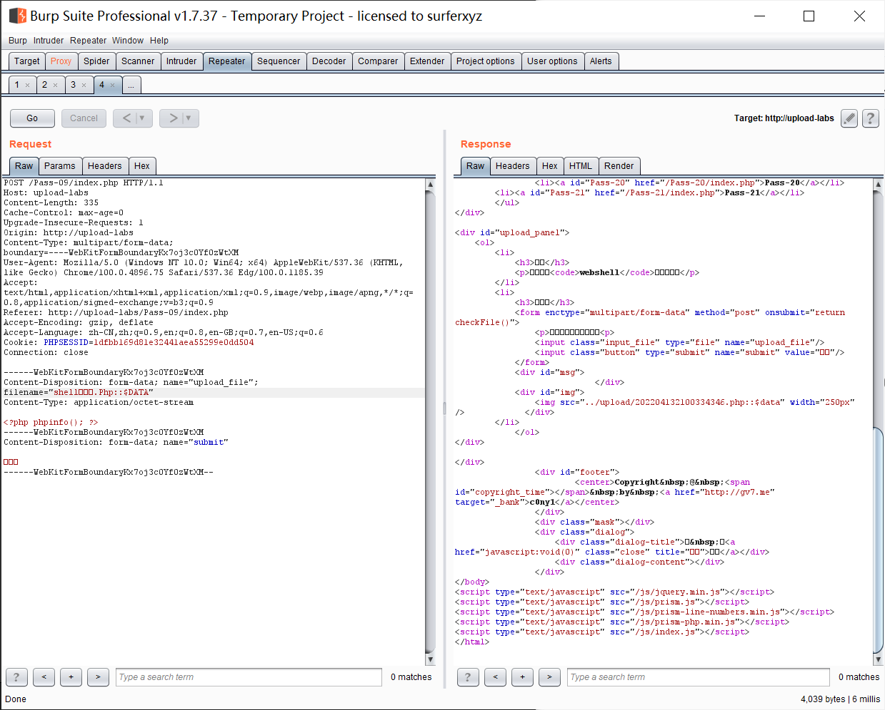

# 知识点：
无去除字符串::$DATA $file_ext = str_ireplace('::$DATA', '', $file_ext);//去除字符串::$DATA 当从 Windows shell [命令行](https://so.csdn.net/so/search?q=%E5%91%BD%E4%BB%A4%E8%A1%8C&spm=1001.2101.3001.7020)指定创建文件时，流的完整名称为 "**filename**:**stream name**:**stream type**"，如示例中所示： "myfile.txt:stream1:$DATA"
# 思路：
发现文件被成功的上传到服务器，且名称后缀为.php::$data，但是由于Windows的特性在磁盘中会忽略::$data并将文件新建。 
