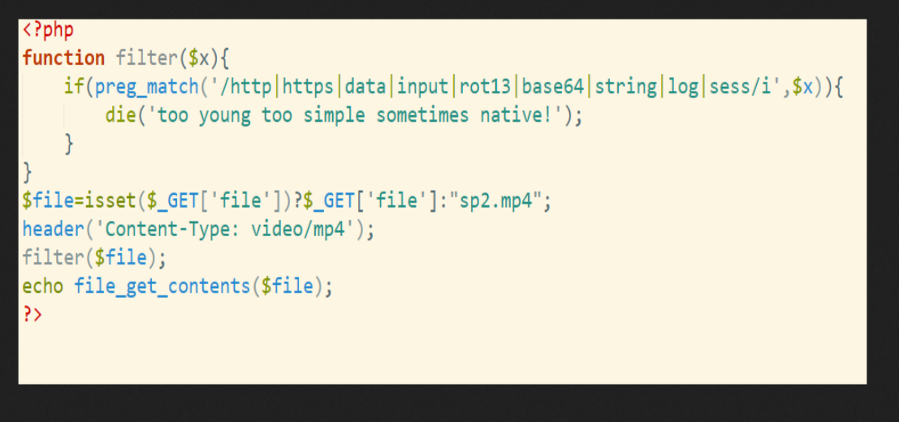
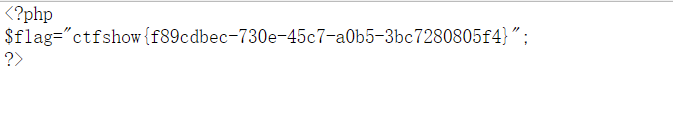
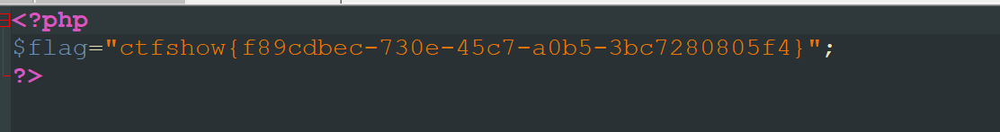
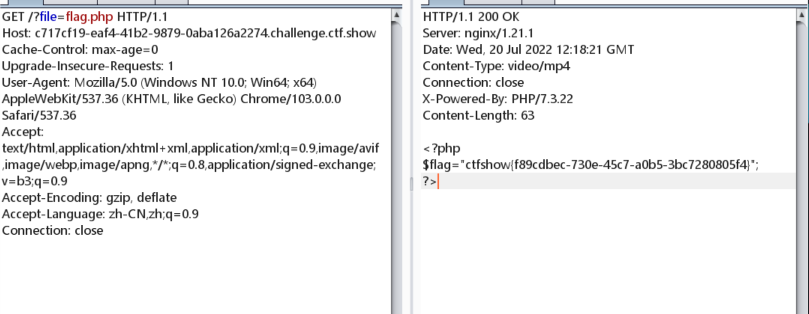

# 知识点
视频隐写 + 文件包含
# 思路
先把文件下载下来，用foremost分离，得到一个png图片，里面有源代码<br />
```php
?file=flag.php
```
因为Content-Type: video/mp4 所以无法在浏览器上看到数据，可以有一下几种方法看到源代码
### view-source://

### ctrl+s保存视频查看源代码

### 用bp直接抓取响应报文

