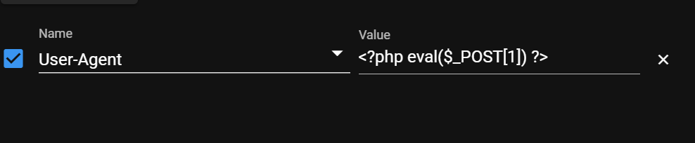
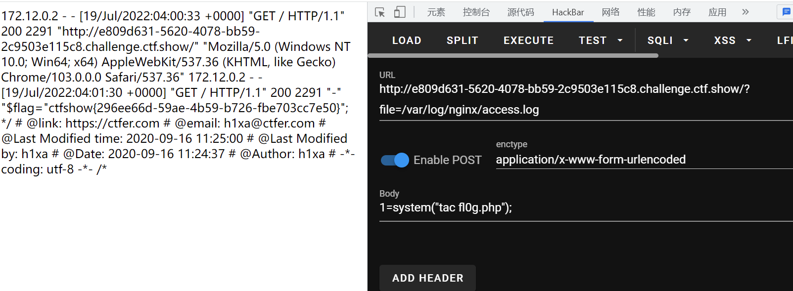
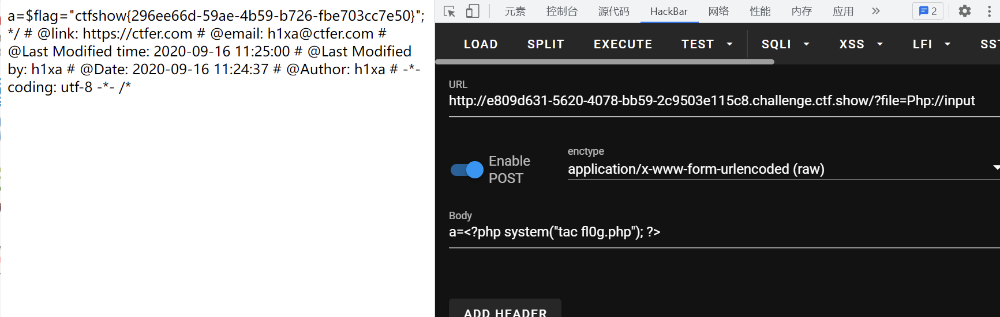

# 知识点
log注入文章 [https://blog.csdn.net/weixin_45588247/article/details/119401092](https://blog.csdn.net/weixin_45588247/article/details/119401092)
# 思路
### 方法一 log包含
先在UA头加上一句话木马  通过包含ngnix日志文件达到getshell 
### 方法二 php://input
php://input 的php进行大小写组合 data://协议不可以 
