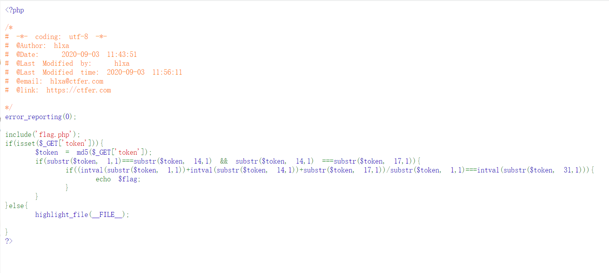

# 知识点
爆破
# 思路
网页源码<br /><br />写代码爆破匹配
```php
<?php
    for ($i = 0; $i < 1000; $i++) {
        $token = md5($i);
        if(substr($token, 1,1)===substr($token, 14,1) && substr($token, 14,1) ===substr($token, 17,1)){
            if((intval(substr($token, 1,1))+intval(substr($token, 14,1))+substr($token, 17,1))/substr($token, 1,1)===intval(substr($token, 31,1))){
                echo $i;
            }
        }
    }
```
token为422时可以通过

