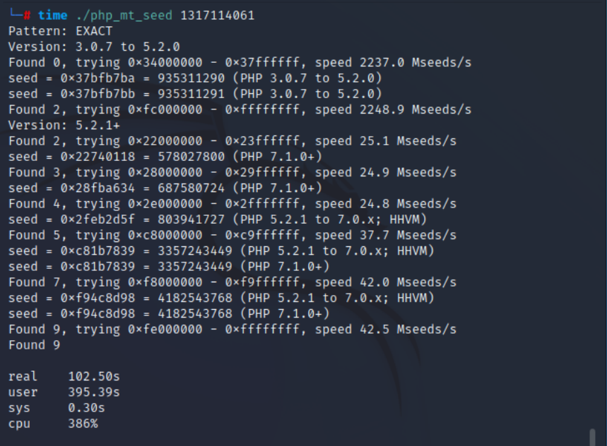
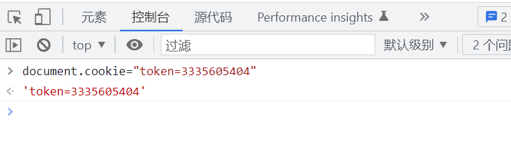

# 知识点
### php_mt_seed
[https://www.cnblogs.com/zaqzzz/p/9997855.html](https://www.cnblogs.com/zaqzzz/p/9997855.html)
# 思路
网页源码
```php
<?php

/*
# -*- coding: utf-8 -*-
# @Author: h1xa
# @Date:   2020-09-03 13:56:57
# @Last Modified by:   h1xa
# @Last Modified time: 2020-09-03 15:47:33
# @email: h1xa@ctfer.com
# @link: https://ctfer.com

*/


error_reporting(0);
include("flag.php");
if(isset($_GET['r'])){
    $r = $_GET['r'];
    mt_srand(hexdec(substr(md5($flag), 0,8)));
    $rand = intval($r)-intval(mt_rand());
    if((!$rand)){
        if($_COOKIE['token']==(mt_rand()+mt_rand())){
            echo $flag;
        }
    }else{
        echo $rand;
    }
}else{
    highlight_file(__FILE__);
    echo system('cat /proc/version');
}
Linux version 5.4.0-110-generic (buildd@ubuntu) (gcc version 9.4.0 (Ubuntu 9.4.0-1ubuntu1~20.04.1)) #124-Ubuntu SMP Thu Apr 14 19:46:19 UTC 2022 Linux version 5.4.0-110-generic (buildd@ubuntu) (gcc version 9.4.0 (Ubuntu 9.4.0-1ubuntu1~20.04.1)) #124-Ubuntu SMP Thu Apr 14 19:46:19 UTC 2022
```
?r=0获得第一次mt_rand()值<br /><br />用php_mt_seed爆破seed值（可能会有多个seed值，需要多次尝试）<br /><br />写脚本运行出token值
```php
<?php
    mt_srand(3357243449);
    echo mt_rand();
    echo "<br>";
    echo mt_rand() + mt_rand();
```
<br />设置Cookie<br /><br />访问成功获得flag<br />
