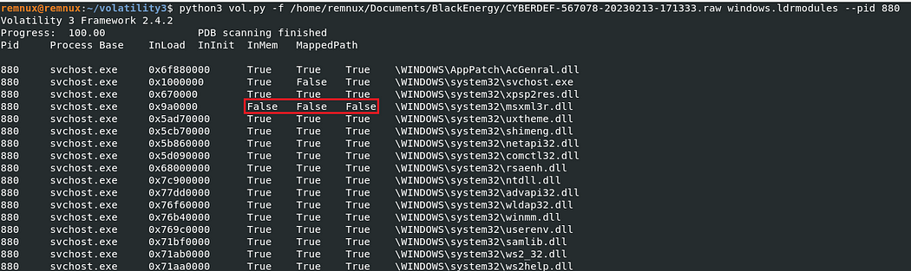

# 知识点
### code injection
--**malfind**   The malfind plugin can be used to detect processes that potentially contain injected code.
### 隐藏的DLL
--**ldrmodules **是 Windows 中的一个命令行实用工具，用于检测系统中存在的未链接动态链接库（DLL）。未链接的 DLL 是指已经加载到进程地址空间中，但没有与磁盘上的任何可执行文件进行链接的 DLL。它们可能是恶意活动的迹象，因为它们可能是攻击或恶意软件安装的一部分。  The msxml3r.dll does not exist in any of the 3 DLL lists (InLoad, InInit, and InMem). The columns InLoad, InInit, and InMem indicates whether a module has been loaded into memory, initialized, or is currently in the process memory. If all these columns are False, it may indicate the presence of a rootkit or other malicious software that is trying to hide its presence.
# 工具

1. [Volatility 2](https://github.com/volatilityfoundation/volatility)
# 思路
[https://responderj01.medium.com/blackenergy-walkthrough-cyberdefenders-8502d4e37301](https://responderj01.medium.com/blackenergy-walkthrough-cyberdefenders-8502d4e37301)
