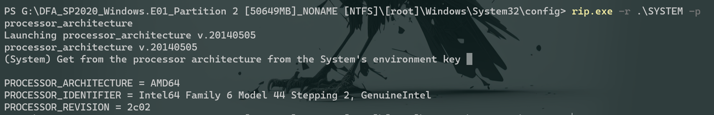

# 知识点
### Windows注册表
[Windows 取证之注册表 - FreeBuf网络安全行业门户](https://www.freebuf.com/articles/network/278581.html)<br />[详解Windows注册表分析取证 - cagebird - 博客园](https://www.cnblogs.com/dsli/p/7298388.html)
### CRC64哈希校验
7-Zip可以进行CRC校验
### LastUsedUsername
```shell
HKEY_LOCAL_MACHINE\SOFTWARE\Microsoft\Windows NT\CurrentVersion\WinLogon\LastUsedIsername
```
### TaskBar（任务栏）

# 工具

- [FTK Imager](https://accessdata.com/product-download/ftk-imager-version-4-5)
- [Registry Explorer](https://ericzimmerman.github.io/#!index.md)
- [RegRipper](https://github.com/keydet89/RegRipper3.0)

RegRipper（注册表解析工具） 命令行版 rip.exe 像volitatility一样可以使用一系列插件<br />-- winver v.20200525 [Software] - Get Windows version & build info
```shell
HKEY_LOCAL_MACHINE/SOFTWARE/Microsoft/Windows NT/CurrentVersion/CurrentBuildNumber
```
<br />-- samparse v.20220921 [SAM] - Parse SAM file for user & group mbrshp info
```shell
HKEY_LOCAL_MACHINE/SAM
```
<br />-- processor_architecture v.20140505 [System]- Get from the processor architecture from the System's environment key
```shell
HKEY_LOCAL_MACHINE\SYSTEM\CurrentControlSet\Control\Session Manager\Environment
```
<br />-- compname v.20090727 [System] - Gets ComputerName and Hostname values from System hive
```shell
HKEY_LOCAL_MACHINE\SYSTEM\CurrentControlSet\Control\ComputerName\ComputerName
```
<br />--  recentapps v.20200515 [NTUSER.DAT] - Gets contents of user's RecentApps key<br />可以获取该用户对某些应用的最新一次访问时间和启动次数
```shell
HKEY_CURRENT_USER\SOFTWARE\Microsoft\Windows\CurrentVersion\Search\RecentApps
```
<br />-- run v.20200511 [Software, NTUSER.DAT] - [Autostart] Get autostart key contents from Software hive
```shell
HKEY_LOCAL_MACHINE\SOFTWARE\Microsoft\Windows\CurrentVersion\Run
HKEY_CURRENT_USER\SOFTWARE\Microsoft\Windows\CurrentVersion\Run
```
<br />-- ips v.20200518 [System] - Get IP Addresses and domains (DHCP,static)<br />

- [PECmd](https://github.com/EricZimmerman/PECmd)   对Prefetch预读文件进行解析
- [TrID](https://www.mark0.net/soft-trid-e.html)   一款可以自动解析文件可能后缀格式的命令行工具


# 思路
[CyberDefenders: CorporateSecrets](https://forensicskween.com/ctf/cyberdefenders/corporatesecrets/)<br />[CorporateSecrets - Writeups](https://evgenblohm.gitbook.io/writeups/undefined/cyberdefenders/corporatesecrets#question-0)

