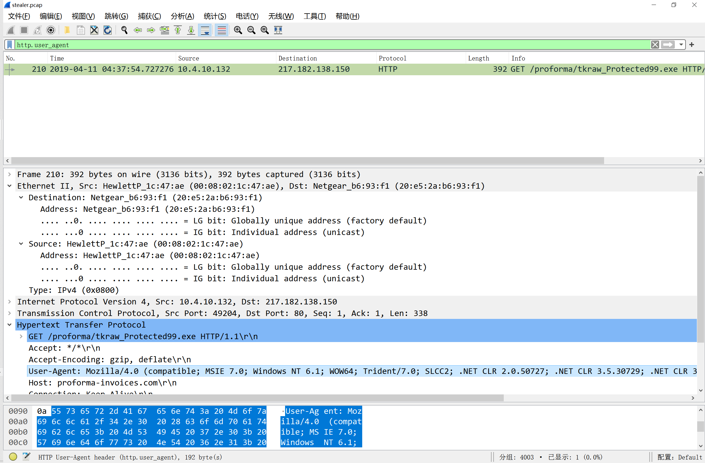
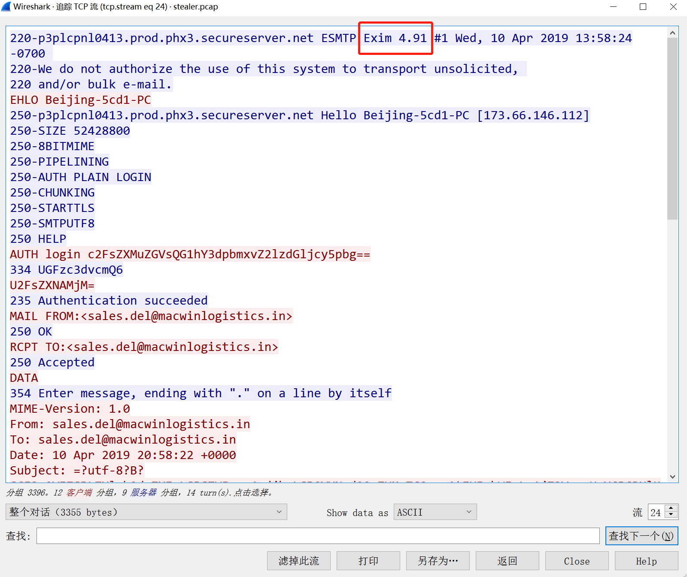

# 知识点
### Host Name
可以通过查看DHCP来获得
### User-Agent
通过http的user-agent可以获取某一主机的操作系统信息 
### 邮件服务器运行软件
在SMTP的协议头可以看到 
# 工具

- [Wireshark](https://www.wireshark.org/download.html)
- [CyberChef](https://gchq.github.io/CyberChef/)
- [VirusTotal](https://www.virustotal.com/gui/home/upload)
- [AbuseIPDB](https://www.abuseipdb.com/)
- [Whois](https://www.whois.com/whois/)
- [IP Subnet Calculator](https://www.calculator.net/ip-subnet-calculator.html)
- [Mac Address Lookup](https://dnschecker.org/mac-lookup.php)
- [NetworkMiner](https://www.netresec.com/?page=networkminer)
# 思路
[https://responderj01.medium.com/hawkeye-walkthrough-cyberdefenders-aea9f0799a6b](https://responderj01.medium.com/hawkeye-walkthrough-cyberdefenders-aea9f0799a6b)
