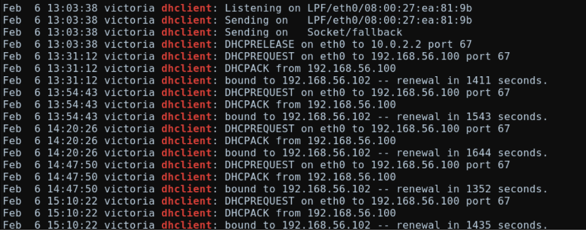

# 知识点
### Auth.log
/var/log/auth.log 是 Linux 系统中记录用户登录和认证相关的日志文件。当用户尝试登录系统，或者进行诸如 su、sudo、ssh 等操作时，这些事件将会被记录在 /var/log/auth.log 文件中。<br />该日志文件可以帮助管理员了解谁、何时、从哪个 IP 地址以及使用了哪种身份验证方式登录到系统，并且可以对安全事件进行审计和调查。例如，如果您怀疑系统受到黑客攻击或者其他未经授权的访问，您可以查看该文件以获取有关事件时间、来源和详细信息的线索。
### syslog
/var/log/syslog是一个文件路径，指向Linux系统中存储系统日志的文本文件。该文件包含了系统及其组件的各种活动、错误和警告信息，例如启动和关闭时间戳、内核消息、系统进程信息等。它是Linux系统管理员进行故障排除和监控系统性能的重要工具之一。通过查看syslog，管理员可以了解系统中的任何问题或异常，并根据需要采取必要的修复措施。<br /><br />"the dhclient was bound to 192.168.56.102" 的含义是指DHCP客户端已经成功地获得了由DHCP服务器分配的IP地址，并将该IP地址与该客户端进行了绑定。
### wc
wc 是一个用于计算文件或标准输入中字节数、字数、行数的Linux/Unix命令。<br />wc 命令的常见选项：<br />-c：输出文件中的字节数。<br />-w：输出文件中的单词数。<br />-l：输出文件中的行数。<br />在 wc -l 命令中，-l 选项用于输出文件中的行数。
```shell
cat /mnt/Linux/var/log/auth.log | grep 'Failed' | wc -l
#returns 32
```
### Linux系统信息
您可以使用以下命令来查看Linux系统信息：<br />1、uname -a：显示内核版本和系统架构信息。<br />2、cat /etc/*-release：显示Linux发行版信息。<br />3、hostnamectl：显示主机名、操作系统类型、版本、架构等信息<br />4、/etc/issue： 是一个包含系统欢迎信息的文件。当用户登录到系统时，该文件中的内容将被显示在登录提示符之前。通常，在 issue 文件中会包含操作系统的名称、版本和发行版信息，以及一些其他的欢迎信息或警告消息。一些系统管理员还可能使用 issue 文件来显示其他有用的系统信息，如上次登录时间或网络配置信息等。
### IP地址信息
#### /var/lib/dhcp3/dhclient.eth0.leases 
/var/lib/dhcp3/dhclient.eth0.leases 是一个 DHCP 客户端 lease 文件，它包含了 DHCP 服务器分配给该客户端的 IP 地址、子网掩码、默认网关、DNS 等网络配置信息。<br />在 Linux 系统中，DHCP 客户端通过发送 DHCP Discover 报文来请求 IP 地址等信息，DHCP 服务器将根据自己的规则为客户端分配 IP 地址和其他网络配置信息，并将其写入 lease 文件。之后，DHCP 客户端可以通过读取 lease 文件来获取网络配置信息并应用到系统中。
### Linux_bash
vol的插件，获取linux内的命令
### linux_enumerate_files
vol的插件，枚举文件
### linux 防火墙设置
在Linux系统中，防火墙一般使用iptables或者firewalld这两种工具来进行管理。下面简要介绍一下如何修改它们的防火墙规则：<br />**修改iptables**<br />iptables是一个功能强大的防火墙软件，可用于设置各种网络安全策略。要修改iptables的规则，可以按照以下步骤操作：<br />查看已有规则：sudo iptables -L<br />添加规则：sudo iptables -A INPUT -p tcp --dport 80 -j ACCEPT。此命令将允许所有来自TCP端口80的数据包通过INPUT链。<br />删除规则：sudo iptables -D INPUT 2。此命令将删除INPUT链中的第2条规则。<br />注：以上命令只能在IPv4环境下使用。如果是IPv6环境，需要使用ip6tables命令。<br />**修改firewalld**<br />firewalld是一个更加高级的防火墙管理工具，相比iptables更加易于使用。要修改firewalld的规则，可以按照以下步骤操作：<br />查看当前状态：sudo firewall-cmd --state<br />添加规则：sudo firewall-cmd --zone=public --add-port=80/tcp --permanent。此命令将添加一条永久性规则，允许TCP端口80通过公共区域的防火墙。<br />删除规则：sudo firewall-cmd --zone=public --remove-port=80/tcp --permanent。此命令将删除公共区域防火墙上的TCP端口80规则。
### 自制profile
[如何基于volatility2构建“新”版本内核的profile - 跳跳糖](https://tttang.com/archive/1801/)
# 工具

- [Volatility](https://github.com/volatilityfoundation/volatility)
# 思路

[CyberDefenders: Ulysses](https://forensicskween.com/ctf/cyberdefenders/ulysses/)
