### 参考资料
[Raid重组复习 - 0xL4k1d - 博客园](https://www.cnblogs.com/0xl4k1d/p/15449572.html)
# RAID概念
### RAID定义
Redundant Array of Indenpendent Disk 独立（廉价）磁盘冗余阵列
### RAID优点
更大的存储空间；更快的传输速度；更高的数据安全性
### RAID术语

- 物理盘：物理盘是指创建RAID所用的每块独立的物理硬盘
- 逻辑盘：多块物理盘RAID之后，多块物理盘就组成新的硬盘
- 热备盘：热备盘是指RAID中空闲、加电并待机的硬盘
- 盘序：多块物理盘在创建RAID时，这些物理盘安排在RAID组中的先后顺序
- 条带大小：在RAID中每块物理盘被分割为一个一个的大小相等单元，称为RAID的条带，是RAID处理数据的基本单元
# RAID 0概念
### RAID 0 / 条带化
创建 RAID 0 （条带化）至少需要2个磁盘。如果你的数据是非常宝贵的，那么不要使用此RAID级别。
### 特点

- 高性能
- RAID 0 中容量零损失
- 零容错
- 写和读有很高的性能

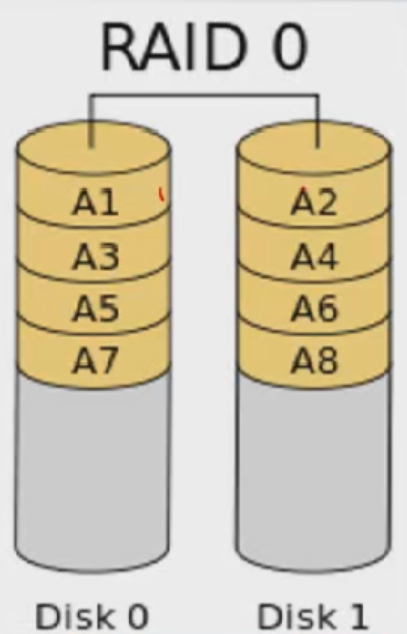
# RAID 1 概念
### RAID 1 / 镜像化
写数据时，它将同时写入这两个（或多个）驱动器中。创建RAID 1 （镜像化）最少需要两个驱动器
### 特点

- 良好的性能
- 总容量丢失一半可用空间
- 完全容错
- 重建会更快
- 写性能会变慢
- 读性能变好
- 能用于操作系统和小规模的数据库

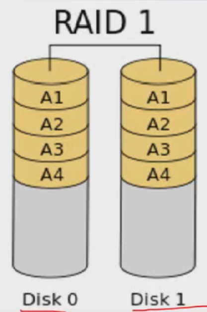
# RAID 4 概念
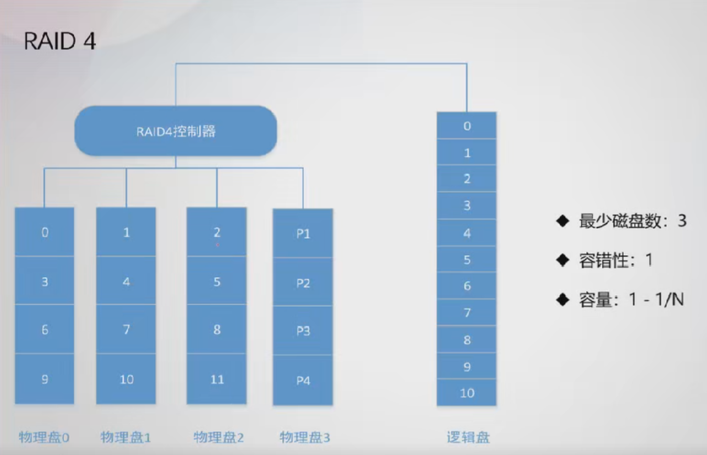
# RAID 5 概念
### RAID 5 / 分布式奇偶校验
RAID 5 多用于企业级。RAID 5 以分布式奇偶校验的方式工作。奇偶校验信息将被用于重建数据。它从剩下的正常驱动器上的信息来重建。在驱动器发生故障时，这可以保护我们的数据

- 性能卓越
- 读速度将非常好
- 写速度处于平均水准，如果我们不使用硬件RAID控制器，写速度缓慢。
- 从所有驱动器的奇偶校验信息中重建
- 完全容错
- 1个磁盘空间将用于奇偶校验
- 可以被用在文件服务器，Web服务器，非常重要的备份中

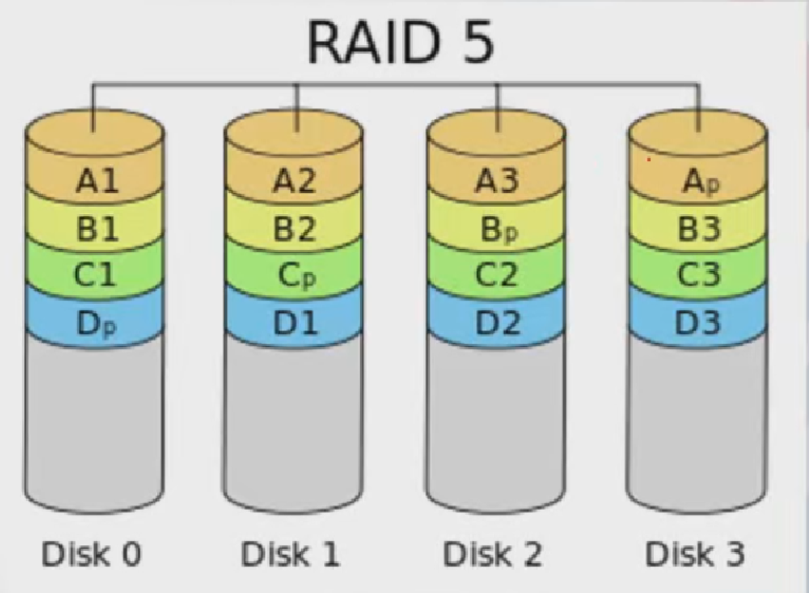 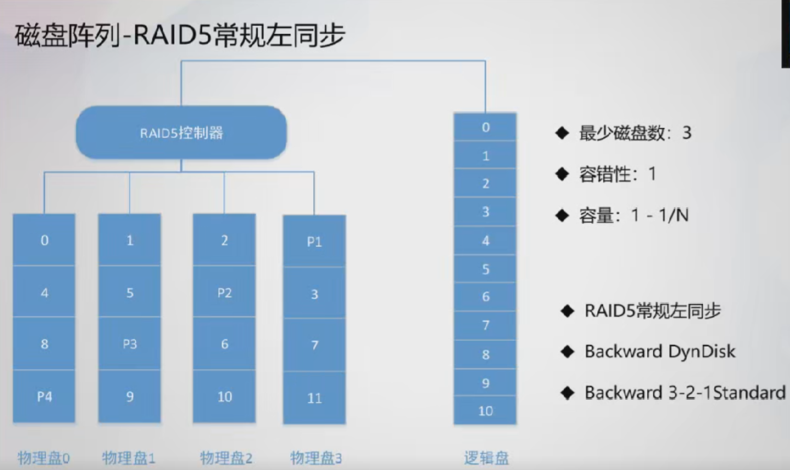 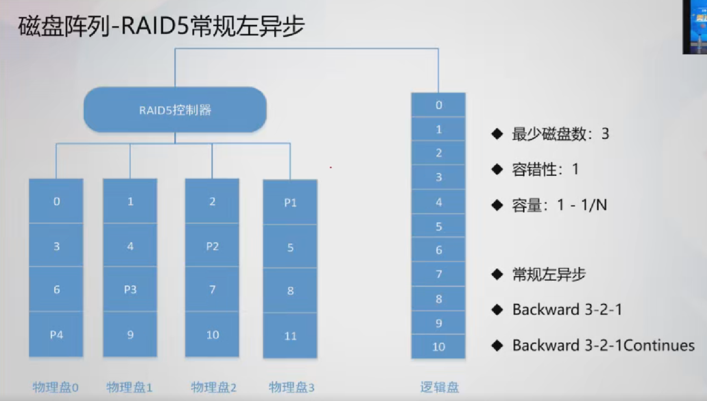 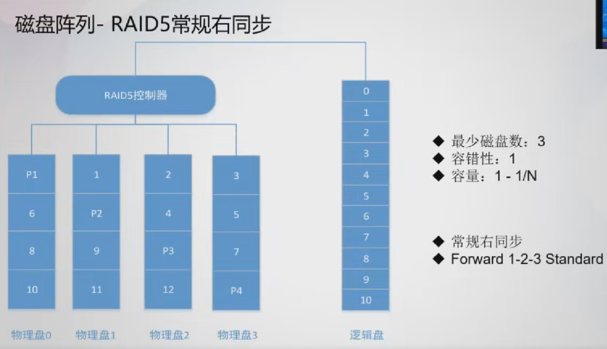
# RAID 6 概念
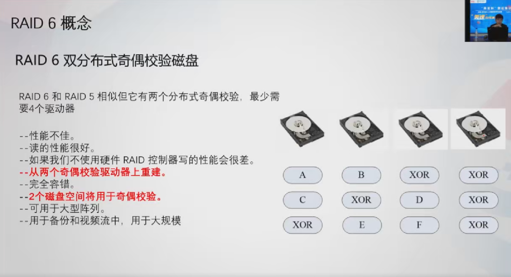
# RAID 10/01 概念
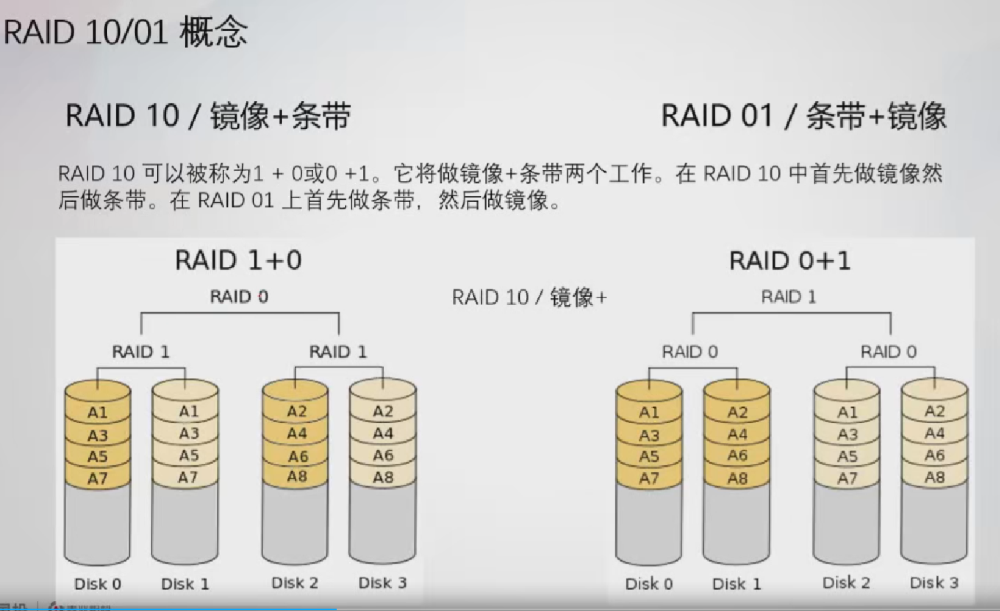
# RAID容量和性能
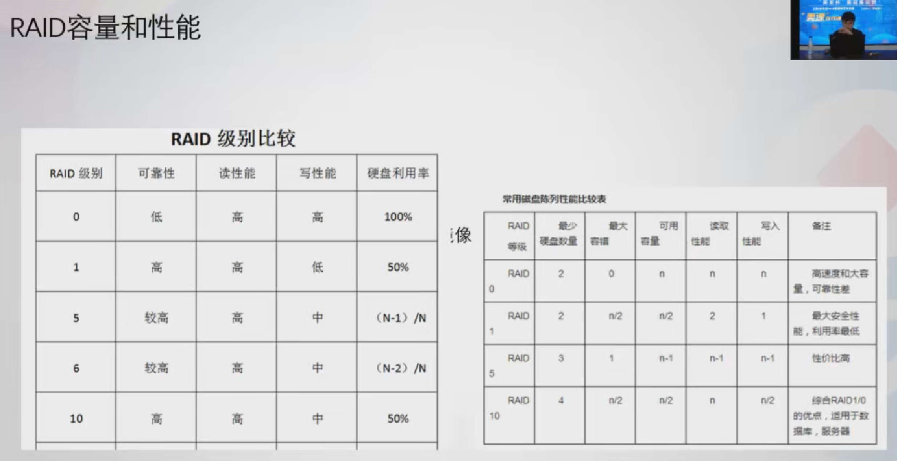
# RAID陈列卡设置名词解释
### Disk Group
磁盘组，这里相当于是阵列，例如配置了一个Raid 1， 就是一个磁盘组；
### VD（virtual Disk）
虚拟磁盘，虚拟磁盘可以不使用阵列的全部容量，也就是说一个可以分为多个VD；
### PD（physical disk）
物理硬盘
### HS（Hot Spare）
热备盘
# RAID 5 配置提及的相关名词
### RAID5的校验和信息，是平均分布到RAID5每个硬盘上。
### 校验和布局方式：

- 左不对称（左异步）（Left-asymmetric）
- 左对称（左同步）（Left-symmetric）
- 右不对称（右异步）（Right-asymmetric）
- 右对称（右同步）（Right-symmetric）
### Stripe(条带)
是raid磁盘阵列中用于数据处理的基本单元 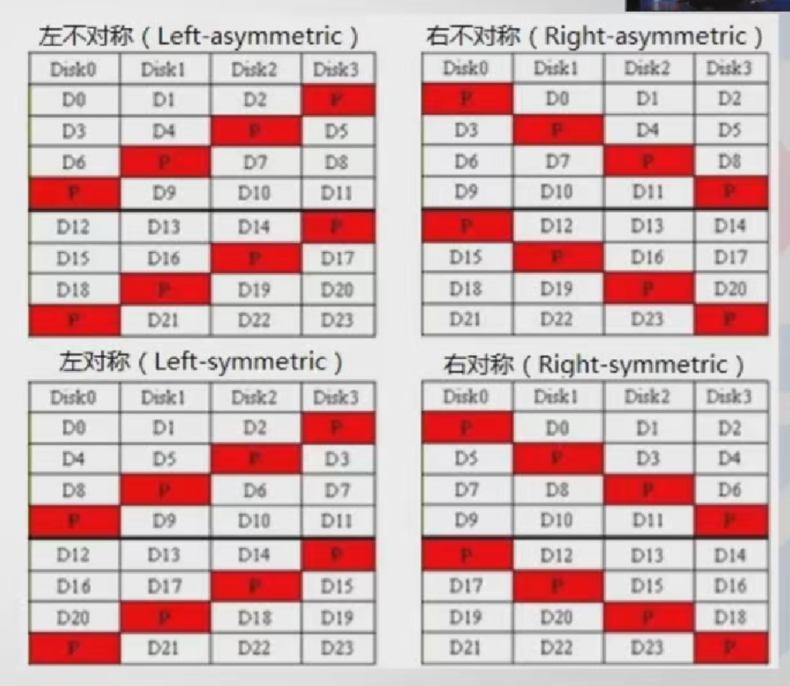
### winHex

- backward parity（Adaptec）：左循环不对称
- backward dynamic（AMI）：左循环对称
- forward parity：右循环不对称
- forward dynamic：右循环对称
- Backward Delayed Parity （HP/Compaq）是HP的双循环结构
### 使用R-Studio进行RAID重组
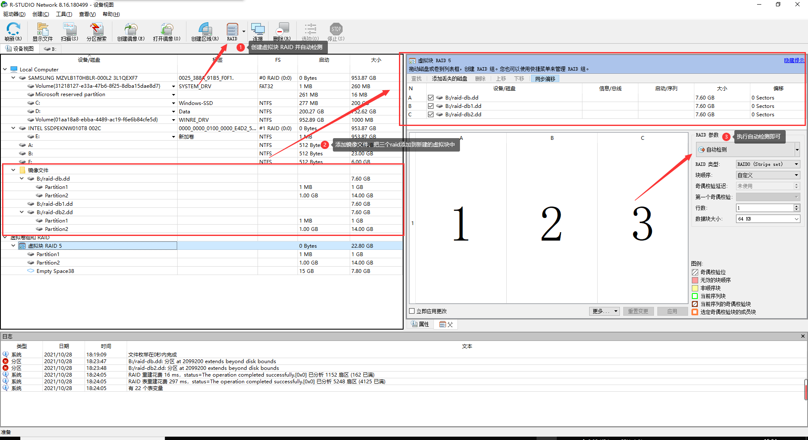 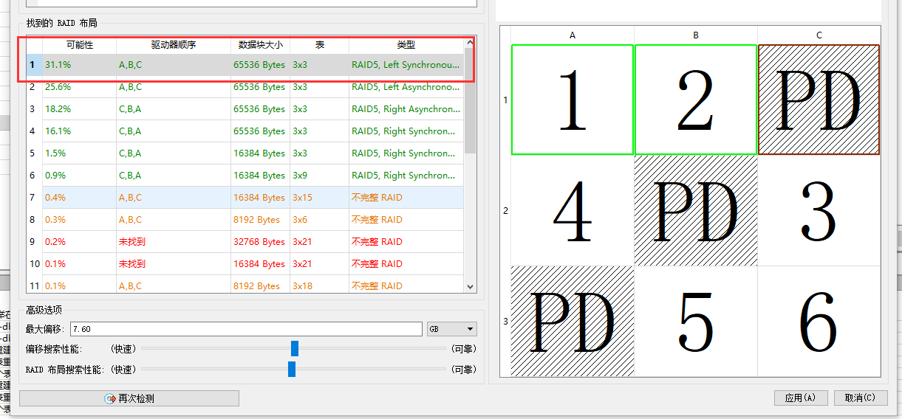 我们可以看到可能性最高的就是 **123 RAID5 左同步**，数据块大小为 **64k**，接下来我们打开取证大师，按照这个配置导入raid，分析结束后再将其重组好的制作成一个新的镜像文件并导出，这样我们就得到了一个可以用来进行仿真的服务器镜像
### 使用UFS自动RAID重组
UFS explorer 下载 [https://www.52pojie.cn/thread-1288005-1-1.html](https://www.52pojie.cn/thread-1288005-1-1.html) 先FTK进行挂载，physical only、read only 再用启动UFS自动RAID重组
